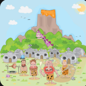
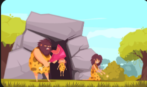
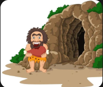

# Story

One hundred cavemen live together.
Every day they need:
food
water
weapons
tools
medicine
Originally...
Everyone kept everything inside their own cave.
Problems appeared.
Food disappeared.
Weapons were lost.
Nobody knew whose tools belonged to whom.
Then...
The chief built one giant storage cave.

Everybody visited that cave whenever they needed something.
That cave became the Server. 

| Caveman | Technology |
|------------|---------------|
| Hunter | Client |
| Storage Cave | Server |
| Village Road | Network |
| Ask for Spear | Request |
| Receive Spear | Response |

Technical Explanation

A server is simply a computer that provides services or resources to other computers across a network.

Phone

↓

Internet

↓

YouTube Server

↓

Video