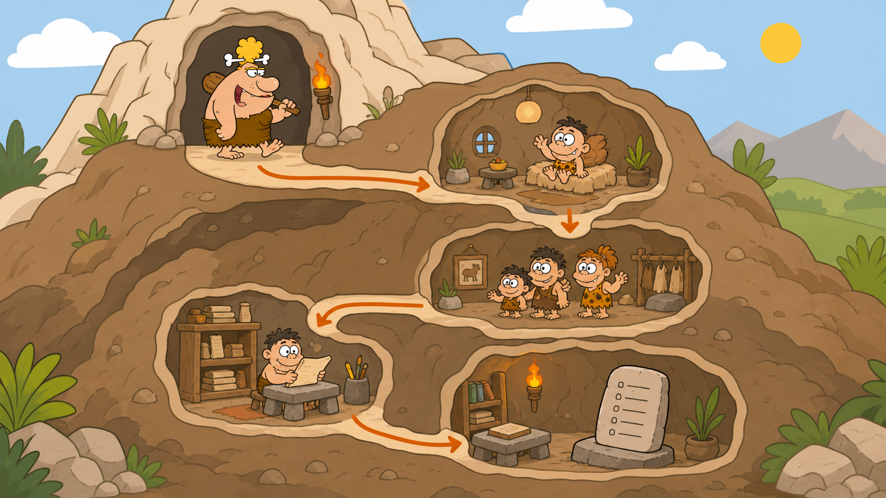

# 03 — Linux Paths

## 🎯 Learning Objectives

By the end of this lesson, you will be able to:

- Read a Linux path from the root directory to a file.
- Distinguish between absolute and relative paths.
- Recognise `.`, `..`, and `~`.
- Move to the parent, home, and root directories using `cd`.

## 🏕️ Caveman Story

Chief Grog asks a messenger to collect a stone tablet called `notes.txt`.

Saying, “It is somewhere in the mountain,” is not enough. The messenger needs an exact route:

```text
Root Cave
    ↓
Home Caves
    ↓
Tharun's Cave
    ↓
Documents Room
    ↓
Linux Shelf
    ↓
notes.txt
```

Linux calls this route a **path**. A path tells the system exactly how to reach a directory or file.

## 🖼️ Big Concept Illustration



### The Linux Route

```text
/
└── home
    └── tharun
        └── Documents
            └── Linux
                └── notes.txt
```

The complete route is:

```text
/home/tharun/Documents/Linux/notes.txt
```

### A Familiar Real-World Map

```text
Country
   ↓
 City
   ↓
Street
   ↓
 House
```

A street address locates a house. A Linux path locates a file or directory.

## 📖 Concept Explained Simply

### Absolute Path

An **absolute path** gives the complete route from `/`, the root of the filesystem.

```text
/
└── home
    └── tharun
        └── Documents
            └── Linux
```

Example: `/home/tharun/Documents/Linux`

Because it begins with `/`, this path means the same thing no matter where you currently stand.

### Relative Path

A **relative path** starts from your current working directory.

If you are already inside `/home/tharun/Documents`, the route to the file can be written as:

```text
.
└── Linux
    └── notes.txt
```

Example: `Linux/notes.txt`

The dot `.` means **the current directory**. It can also be written as `./Linux/notes.txt`.

### Parent Directory

Two dots, `..`, mean **the directory one level above your current location**.

```text
/home/tharun/Documents/Linux
                      │
                      └── .. leads to /home/tharun/Documents
```

### Home Directory

The tilde `~` is a shortcut for the current user's home directory.

```text
~  →  /home/tharun
```

The username and home location may differ, but `~` still points to that user's home.

> Linux paths are case-sensitive. `Documents`, `documents`, and `DOCUMENTS` can refer to three different names.

## 🌍 Real Linux Example

A service may store its configuration at `/etc/nginx/nginx.conf` and logs at `/var/log/nginx/`. Engineers use absolute paths when a script or procedure must reach the same location reliably. They use relative paths while working inside a known project directory.

## 🛠️ Commands Introduced

This lesson adds three navigation forms of the already introduced `cd` command.

### Move to the Parent Directory

```bash
cd ..
```

Moves one level upward from your current directory.

### Return to Your Home Directory

```bash
cd ~
```

Moves to the current user's home directory.

### Move to the Filesystem Root

```bash
cd /
```

Moves to the top of the Linux filesystem tree.

No file-listing command is introduced in this lesson. The goal is to understand routes before inspecting their contents.

## 💡 Caveman Tip

Ask one question before using a path:

> “Does this route begin at the mountain entrance, or from where I am standing?”

- Begins with `/` → absolute path.
- Begins from the current location → relative path.

## ⚠️ Common Mistakes

- Confusing `/` with `/root`. `/` is the filesystem's top; `/root` is the root user's home.
- Forgetting that names are case-sensitive.
- Using `..` when you mean `.`.
- Assuming `~` means the same absolute location for every user.
- Omitting a `/` between directory names.

## 🧪 Hands-on Lab

1. Open a Linux terminal.
2. Move to the filesystem root:

   ```bash
   cd /
   ```

3. Return to your home directory:

   ```bash
   cd ~
   ```

4. Move to the parent of your home directory:

   ```bash
   cd ..
   ```

5. Repeat the journey and describe each destination before moving.

### Engineer Challenge

Classify each path as absolute, relative, or a home shortcut:

- `/var/log`
- `Documents/Linux/notes.txt`
- `./Linux/notes.txt`
- `../images`
- `~/projects`

## 📝 Quick Recap

- A path is a route to a file or directory.
- Absolute paths begin at `/`.
- Relative paths begin from the current directory.
- `.` means current directory, `..` means parent directory, and `~` means home.
- Linux paths are case-sensitive.

## 🧠 Interview Questions

1. What is the difference between an absolute and a relative path?
2. What do `.`, `..`, and `~` represent?
3. Why does `/home/tharun` work regardless of the current directory?
4. Are Linux paths case-sensitive?
5. What is the difference between `/` and `/root`?

## 📚 What's Next

You can now read routes through the cave. Next, you will learn how to inspect and create the **files and directories** found along those routes.
