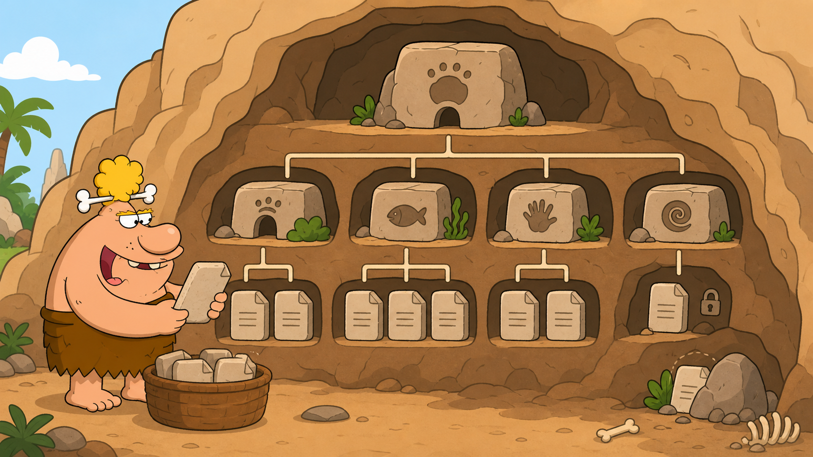

# 04 — Files and Directories

## 🎯 Learning Objectives

By the end of this lesson, you will be able to:

- Explain the difference between a file and a directory.
- Recognise hidden files and understand the idea of permissions.
- List directory contents in useful formats.
- Create directories and empty files.
- Display a project as a directory tree.

## 🏕️ Caveman Story

Chief Grog has learned the routes through the mountain. Now he must organise the objects inside each room.

A **directory** is a cave room that can hold other rooms and stone tablets. A **file** is a tablet containing information. Some tablets are placed out of ordinary sight, and protected tablets carry a lock showing who may use them.

Knowing the path gets Grog to the right room. Understanding files and directories lets him work inside it.

## 🖼️ Big Concept Illustration



### The Basic Objects

```text
📁 Linux/          Directory: holds other items
📄 notes.txt       File: stores information
🙈 .hidden         Hidden: name begins with a dot
🔒 secrets.txt     Protected: access depends on permissions
```

### A Project Tree

```text
Project/
├── README.md
├── images/
└── notes/
    └── lesson.txt
```

The branches show which items belong inside other directories.

## 📖 Concept Explained Simply

### Directory

A **directory** is a container used to organise files and other directories. The `/` after a name is often shown in documentation to make the directory easy to recognise.

### File

A **file** stores data such as text, configuration, an image, a program, or a log. Linux does not require a filename extension, although extensions such as `.txt` and `.png` help people and applications understand the content.

### Hidden File

A name beginning with a dot is hidden from an ordinary directory listing. Examples include `.profile` and `.config`. Hidden does not mean secret or secure—it only means **not shown by default**.

### Permissions Teaser

Linux records who may read, change, or run an item. You will study permissions in the treasure-protection chapter. For now, remember that seeing a file does not automatically mean you may modify it.

## 🌍 Real Linux Example

A software project might contain a `README.md` file, an `images` directory, source files, scripts, and hidden configuration. Engineers inspect this structure before changing code, running automation, or troubleshooting a deployment.

## 🛠️ Commands Introduced

### `ls` — List Directory Contents

```bash
ls
```

Shows visible items in the current directory.

```bash
ls -l
```

`-l` means **long format**. It shows details such as permissions, owner, group, size, modification time, and name.

```bash
ls -a
```

`-a` means **all**. It includes hidden names beginning with `.` as well as the `.` and `..` directory entries.

```bash
ls -lh
```

This combines two options:

- `-l` uses long format.
- `-h` displays sizes in human-readable units such as KB, MB, and GB. It is meaningful here because long format displays sizes.

### `mkdir` — Make a Directory

```bash
mkdir LinuxPractice
```

Creates a new directory named `LinuxPractice`. The parent location must already exist.

### `touch` — Create an Empty File

```bash
touch notes.txt
```

Creates an empty file when the name does not exist. If it already exists, `touch` updates its timestamps without replacing its contents.

### `tree` — Display a Hierarchy

```bash
tree LinuxPractice
```

Displays directories and files as branches. Some minimal Linux installations do not include `tree` by default; install it with the distribution's package manager when appropriate.

## 💡 Caveman Tip

Use `ls -la` when troubleshooting a directory. It combines long details with hidden entries. Use `ls -lh` when file sizes matter.

## ⚠️ Common Mistakes

- Thinking hidden files are encrypted or protected.
- Assuming `touch` opens a text editor or writes content.
- Creating an item in the wrong working directory.
- Reading the size shown for a directory as the total size of everything inside it.
- Assuming `tree` is preinstalled on every server.

## 🧪 Hands-on Lab

### Mini Project: `LinuxPractice`

Create the main project and its directories:

```bash
mkdir LinuxPractice
mkdir LinuxPractice/notes
mkdir LinuxPractice/images
mkdir LinuxPractice/scripts
mkdir LinuxPractice/logs
```

Create a few empty project files:

```bash
touch LinuxPractice/README.md
touch LinuxPractice/notes/lesson.txt
touch LinuxPractice/scripts/health-check.sh
touch LinuxPractice/.project-config
```

List the project in different views:

```bash
ls LinuxPractice
ls -l LinuxPractice
ls -a LinuxPractice
ls -lh LinuxPractice
```

Display the finished structure:

```bash
tree LinuxPractice
```

Expected shape:

```text
LinuxPractice/
├── README.md
├── images/
├── logs/
├── notes/
│   └── lesson.txt
└── scripts/
    └── health-check.sh
```

The hidden `.project-config` may appear only when the chosen view includes hidden entries.

### Practice Checklist

- **Create:** Build the directories and files above.
- **Navigate:** Use the navigation knowledge from the previous lessons to move through the project.
- **List:** Compare the ordinary, long, hidden, and human-readable views.
- **Delete:** Identify which test items should eventually be removed, but do not delete them yet. Deletion commands are intentionally reserved for the dedicated file-commands lesson because they can destroy data.

## 📝 Quick Recap

- Directories organise files and other directories.
- A leading dot makes a name hidden from ordinary listings, not secure.
- `ls` lists items, `mkdir` creates directories, and `touch` creates empty files.
- `tree` shows the hierarchy visually.
- Permissions control access and will be covered separately.

## 🧠 Interview Questions

1. What is the difference between a file and a directory?
2. What makes a Linux file hidden?
3. What information does `ls -l` show?
4. Why is `ls -lh` easier to read than `ls -l` for large files?
5. What happens when `touch` is used on an existing file?
6. Why might `tree` be unavailable on a minimal server?

## 📚 What's Next

Your project now has rooms and tablets. Next, you will learn how Linux connects physical, removable, and cloud storage to locations in this same filesystem tree.
