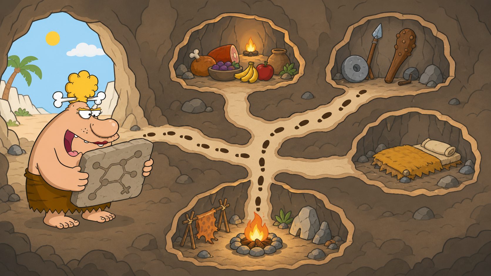

# 01 — Navigation Commands

## 🎯 Learning Objectives

By the end of this lesson, you will be able to:

- Print your current working directory.
- List normal, hidden, and detailed directory contents.
- Move to a directory, home, parent, root, or previous location.
- Confirm your position before changing files.

## 🏕️ Caveman Story

Chief Grog enters a cave with many passages. One leads to food, another to weapons, and another to the sleeping room.

Before taking a step, he asks three questions:

1. Where am I?
2. What is here?
3. Where do I want to go?

Without those answers, even a good map cannot prevent him from becoming lost.

## 🖼️ Big Concept Illustration



```text
                    Cave entrance
                         │
          ┌──────────────┼──────────────┐
          │              │              │
      Food room      Weapon room    Sleeping room
```

```text
Current location → Look around → Move → Check again
      pwd              ls         cd        pwd
```

## 📖 Concept Explained Simply

The shell always has a **current working directory**—the location where an unqualified command acts.

```text
🙂 You are here
│
└── /home/grog/projects
```

Navigation uses three tools:

- `pwd` answers **Where am I?**
- `ls` answers **What is here?**
- `cd` answers **How do I move?**

The shell normally returns no message after a successful `cd`. Use `pwd` when you need confirmation.

## 🌍 Real Linux Example

Before editing an application configuration, a production engineer checks the location and contents of the expected directory. This simple habit reduces mistakes caused by acting on a similarly named file elsewhere.

```text
Check location → Inspect contents → Move deliberately → Verify location
```

## 🛠️ Commands Introduced

### `pwd` — Print Working Directory

```bash
pwd
```

Prints the absolute path of your current location.

### `ls` — List Directory Contents

```bash
ls
```

Lists visible entries in the current directory.

```bash
ls -l
```

`-l` uses long format: permissions, owner, group, size, modification time, and name.

```bash
ls -a
```

`-a` includes hidden names, which begin with `.`.

```bash
ls -lh
```

`-h`, used with `-l`, shows human-readable sizes such as KiB, MiB, and GiB.

```bash
ls -la
```

Combines long format with hidden entries. Short options can be grouped.

You can also inspect a specific location without moving into it:

```bash
ls /var/log
```

### `cd` — Change Directory

```bash
cd /var/log
```

Moves to the supplied path.

```bash
cd ~
```

Moves to the current user's home directory. Running `cd` with no target normally does the same.

```bash
cd ..
```

Moves to the parent directory, one level upward.

```bash
cd -
```

Returns to the previous working directory—useful for switching between two locations.

```bash
cd /
```

Moves to the filesystem root.

## 💡 Caveman Tip

Use the rhythm **check → look → move → check**:

```text
pwd → ls → cd → pwd
```

## ⚠️ Common Mistakes

- Confusing `/` with `/root`; they are different directories.
- Expecting `ls` to show hidden files without `-a`.
- Forgetting that Linux names are case-sensitive.
- Treating spaces in paths as separators without quoting the path.
- Assuming a silent `cd` failed; success normally produces no output.

## 🧪 Hands-on Lab

### Mission: Inspect the Chief's Routes

1. Print your current location.
2. List visible entries.
3. List hidden entries in long format.
4. Move to `/` and confirm your position.
5. Return home.
6. Move to the parent directory.
7. Return to the previous location with `cd -`.
8. Inspect `/var/log` without entering it.

### Engineer Challenge

Navigate between home and `/var/log` three times using `cd -`. Predict the destination before each move.

## 📝 Quick Recap

- `pwd` prints the current location.
- `ls` shows what a directory contains.
- `ls -l`, `-a`, and `-h` change the detail shown.
- `cd` moves through the filesystem.
- `~`, `..`, `-`, and `/` are useful navigation targets.

## 🧠 Interview Questions

1. What is a current working directory?
2. What is the difference between `ls -l` and `ls -la`?
3. What does `cd -` do?
4. Why might an engineer run `pwd` before changing a file?
5. Why can `cd Documents` work while `cd documents` fails?

## 📚 What's Next

You can move around the cave. Next, learn to create, copy, move, rename, and safely remove supplies in [02 — File Commands](02-file-commands.md).
