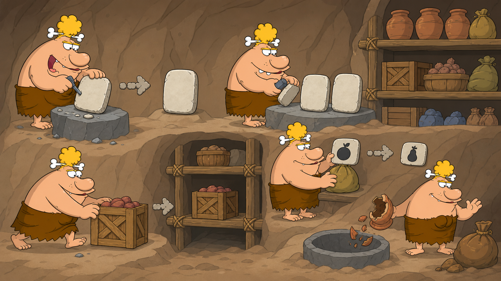

# 02 — File Commands

## 🎯 Learning Objectives

By the end of this lesson, you will be able to:

- Create empty files and directory structures.
- Copy files and directories.
- Move or rename files and directories.
- Remove files and empty or populated directories safely.

## 🏕️ Caveman Story

Chief Grog reaches the storage cave. Supplies arrive every day, so he must create shelves, copy important records, move crates, rename labels, and discard items that are no longer needed.

A tool that creates is safe to practise. A tool that destroys demands a pause.

```text
Create → Copy → Move or rename → Verify → Remove carefully
```

## 🖼️ Big Concept Illustration



```text
Storage Cave
├── records/
│   └── food-list.txt
├── weapons/
└── firewood/
```

```text
Original tablet ──copy──> Original + backup
Supply crate    ──move──> New shelf
Old label       ──move──> New name
Empty item      ─remove─> Gone
```

## 📖 Concept Explained Simply

In Linux, a directory organises names and a file stores data. Most file commands accept a **source** and a **destination**:

```text
tool source destination
```

Copying keeps the source. Moving changes its location or name. Removing usually bypasses a recycle bin and may be permanent.

## 🌍 Real Linux Example

Before changing a service configuration, an engineer may create a backup copy, make the planned change, validate it, and only later remove the backup. This provides a simple rollback path.

```text
Configuration → Backup → Change → Validate → Retain or remove backup
```

## 🛠️ Commands Introduced

### `touch` — Create an Empty File or Update Its Timestamp

```bash
touch village-map.txt
```

Creates an empty file if it does not exist. If it exists, `touch` updates its access and modification timestamps without erasing its contents.

### `mkdir` — Make Directories

```bash
mkdir supplies
```

Creates one directory. Its parent must already exist.

```bash
mkdir -p village/storage/food
```

`-p` creates missing parent directories and does not complain when the requested directories already exist.

### `cp` — Copy

```bash
cp village-map.txt village-map.backup
```

Copies a file. The original remains.

```bash
cp -r supplies supplies-backup
```

`-r` copies a directory and everything below it recursively.

```bash
cp -i village-map.txt archive/village-map.txt
```

`-i` asks before overwriting an existing destination. It is helpful while learning, but scripts should use explicit validation rather than interactive prompts.

### `mv` — Move or Rename

```bash
mv village-map.txt chief-map.txt
```

Renames a file when the destination is a new name in the same directory.

```bash
mv chief-map.txt records/
```

Moves the file into another directory.

```bash
mv -i new-map.txt records/chief-map.txt
```

`-i` asks before replacing an existing destination.

### `rm` — Remove Files or Directory Trees

```bash
rm old-map.txt
```

Removes a file. There is normally no recycle bin.

```bash
rm -r old-supplies
```

`-r` removes a directory tree recursively, including its contents.

```bash
rm -f temporary-marker.txt
```

`-f` suppresses prompts and ignores a missing target. It does **not** make deletion safer.

Never combine recursive and forced removal until you have printed your location and verified the exact target.

### `rmdir` — Remove Empty Directories

```bash
rmdir empty-shelf
```

Removes only an empty directory. Its refusal to remove a non-empty directory is a useful safeguard.

## 💡 Caveman Tip

Before removing anything, say the target aloud and confirm it is inside your practice directory. Prefer `rmdir` when you expect a directory to be empty.

## ⚠️ Common Mistakes

- Reversing the source and destination.
- Forgetting `-r` when copying a directory.
- Assuming `mv` only moves; it also renames.
- Believing `rm` sends items to a recycle bin.
- Using `rm -f` to hide uncertainty or combining it casually with `-r`.
- Overwriting an existing destination without checking it first.

## 🧪 Hands-on Lab

### Mission: Organise the Supply Cave

Perform this only inside a disposable practice directory.

```bash
mkdir -p LinuxToolsLab/storage/food LinuxToolsLab/storage/weapons LinuxToolsLab/storage/archive
touch LinuxToolsLab/storage/food/inventory.txt
cp LinuxToolsLab/storage/food/inventory.txt LinuxToolsLab/storage/archive/inventory.backup
mv LinuxToolsLab/storage/food/inventory.txt LinuxToolsLab/storage/food/food-list.txt
cp -r LinuxToolsLab/storage LinuxToolsLab/storage-copy
touch LinuxToolsLab/temporary-marker.txt
rm LinuxToolsLab/temporary-marker.txt
mkdir LinuxToolsLab/empty-shelf
rmdir LinuxToolsLab/empty-shelf
```

Verify each result using the navigation tools from the previous lesson. When finished, keep the lab directory for later lessons.

### Engineer Challenge

Predict whether each operation copies, moves, renames, or deletes before running it. Explain which original remains afterward.

## 📝 Quick Recap

- `touch` creates an empty file or updates timestamps.
- `mkdir` creates directories; `-p` creates missing parents.
- `cp` preserves the source; `-r` copies directory trees.
- `mv` moves or renames.
- `rm` removes files; `-r` removes trees and `-f` suppresses safeguards.
- `rmdir` removes empty directories only.

## 🧠 Interview Questions

1. What is the difference between `cp` and `mv`?
2. Why is `mkdir -p` useful in automation?
3. What happens when `touch` targets an existing file?
4. Why is `rmdir` safer than recursive removal for an expected empty directory?
5. What risk does `rm -f` introduce?

## 📚 What's Next

The supplies are organised. Next, learn to read records and logs with [03 — Text Processing](03-text-processing.md).
