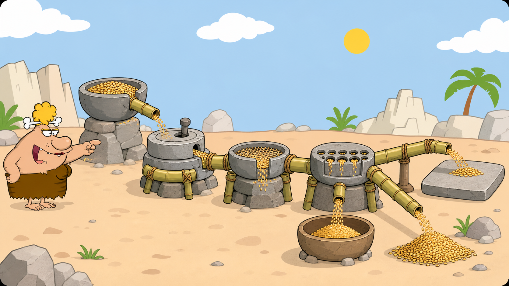

# 05 — Pipes and Redirection

## 🎯 Learning Objectives

By the end of this lesson, you will be able to:

- Explain standard input and standard output.
- Send one command's output into another command.
- Write, append, or read file data using redirection.
- Display and save the same output with `tee`.
- Convert input lines into command arguments with `xargs` safely.

## 🏕️ Caveman Story

Chief Grog's tools are useful alone, but the village problem is larger than one tool can solve.

He builds a pipeline:

```text
Grain bucket → Crusher → Filter → Counter → Storage bowl
```

Each station performs one small job. The output from one becomes the input to the next.

That is the heart of Linux: small tools become powerful when connected.

## 🖼️ Big Concept Illustration



```text
Input → Command A → output → Command B → final result
                         pipe |
```

```text
Keyboard ──> standard input  ──> Program ──> standard output ──> Screen
   File  ──>        <                       > or >>             File
```

```text
Command output ──> tee ──┬──> Screen
                         └──> File
```

## 📖 Concept Explained Simply

Most command-line tools follow a shared data model:

- **Standard input (`stdin`)** is where a command reads data.
- **Standard output (`stdout`)** is where normal results are written.
- The terminal is the usual source and destination, but shell operators can connect commands or files instead.

A pipeline does not create one giant command. It forms a sequence in which every tool has one clear responsibility.

## 🌍 Real Linux Example

An engineer may list processes, filter for a service name, count matching lines, display the result, and save it for an incident record. Pipelines make this possible without writing a script or manually copying output.

The examples below deliberately reuse earlier tools. They are not being reintroduced; this lesson teaches how data flows between them.

## 🛠️ Commands Introduced

### `|` — Pipe Output into Another Command

```bash
ls | grep "txt"
```

The pipe sends the standard output of `ls` to the standard input of `grep`.

```bash
cat names.txt | sort | uniq
```

Each stage transforms the stream: read, sort, then collapse adjacent duplicates. When a command accepts a filename directly, that simpler form may be preferable; this example makes the flow visible.

```bash
ps | grep "ssh"
```

Filters process output for lines containing `ssh`. A matching `grep` process may also appear, which is one reason production engineers use more specialised process queries later in the course.

### `>` — Write Output, Replacing the Destination

```bash
echo "Hello" > message.txt
```

Writes standard output to `message.txt`. It creates the file or **overwrites its existing contents**.

### `>>` — Append Output

```bash
echo "Again" >> message.txt
```

Adds output to the end of the file without replacing existing content.

### `<` — Read Standard Input from a File

```bash
sort < names.txt
```

Makes the file the command's standard input. The output still goes to the terminal unless redirected again.

### `tee` — Display and Save Output

```bash
sort names.txt | tee sorted-names.txt
```

Prints the stream to the screen and writes it to a file.

```bash
echo "new event" | tee -a village.log
```

`-a` appends instead of overwriting.

### `xargs` — Turn Input Items into Arguments

```bash
find LinuxToolsLab -type f -name "*.txt" -print0 | xargs -0 wc -l
```

`xargs` builds command arguments from its input. Here, `find -print0` and `xargs -0` use null separators, so filenames containing spaces or unusual characters remain intact.

Before using `xargs` with a destructive command, first run the pipeline with a harmless command such as `printf` or add an interactive safeguard. Never delete based on unverified generated arguments.

## 💡 Caveman Tip

Read a pipeline from left to right and describe each stage:

```text
produce → filter → transform → save
```

If you cannot explain a stage, do not run the pipeline yet.

## ⚠️ Common Mistakes

- Using `>` when `>>` was intended and overwriting a file.
- Expecting a pipe to pass filenames; it passes text or bytes through standard output and input.
- Building a long pipeline without checking intermediate output.
- Using `tee` without `-a` on a file that must be preserved.
- Using plain `xargs` with filenames containing whitespace.
- Sending generated arguments into a destructive command without reviewing them.

## 🧪 Hands-on Lab

### Mission: Build the Chief's Final Report

Work only with your practice files.

1. Save a greeting to `report.txt` with `>`.
2. Append a second line with `>>`.
3. Sort a names file using `<` as input.
4. Connect `sort` and `uniq` to remove repeated adjacent names.
5. Count the final lines by adding the appropriate text tool to the pipeline.
6. Filter a practice log for `error`, ignoring case.
7. Use `tee` to both view and save the filtered result.
8. Find `.txt` files and safely count their lines with the null-delimited `xargs` pattern shown above.

### Final Engineer Challenge

Create `village-report.txt` containing a sorted, unique list of error lines from a practice log. Explain the input, every stage, and the final destination before running the workflow.

## 📝 Quick Recap

- `|` connects one command's output to another's input.
- `>` replaces a file; `>>` appends to it.
- `<` supplies a file as standard input.
- `tee` displays and saves the same stream.
- `xargs` converts input items into command arguments.
- Small tools become workflows through predictable data flow.

## 🧠 Interview Questions

1. What is the difference between standard input and standard output?
2. What is the difference between `>` and `>>`?
3. What does a pipe transfer between commands?
4. When is `tee` more useful than `>`?
5. Why are `find -print0` and `xargs -0` paired?
6. How would you debug a pipeline that produces the wrong result?

## 📚 What's Next

You now know how to connect small Linux tools. Next, learn how the shell understands those instructions in [06 — Help and Shell Fundamentals](06-help-and-shell-fundamentals.md).
