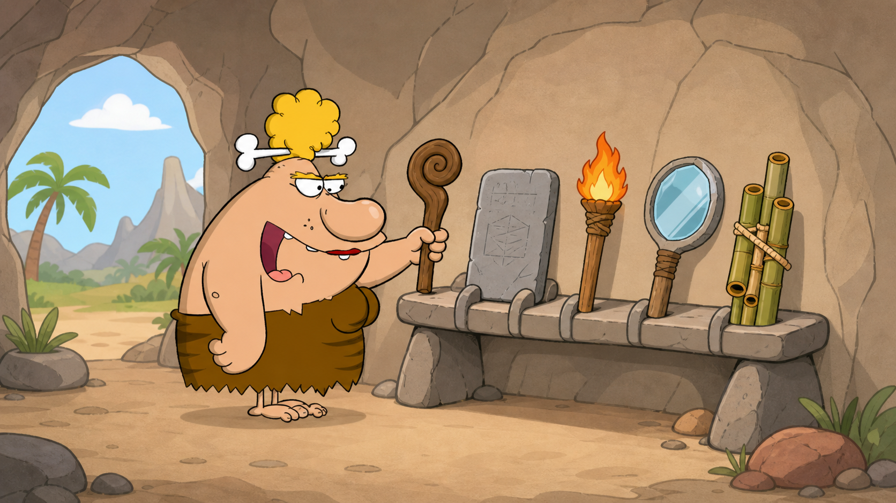

# 04 — Finding Your Tools: Learn Linux Commands

## 🎯 Learning Objectives

By the end of this module, you will be able to:

- Choose a command based on the problem you need to solve.
- Navigate, manage files, inspect text, and search Linux systems.
- Connect small commands into practical workflows.
- Read command output instead of memorising command lists.

## 🏕️ Caveman Story

Chief Grog has learned the cave map. He knows where the food, weapons, records, and storage rooms are.

But knowing where food is does not help if he cannot collect it.

He needs tools:

- A walking staff to move through the cave.
- A hammer to create and manage supplies.
- A torch to read ancient writings.
- A magnifier to find lost objects.
- Pipes to connect one tool to another.

Linux commands are the same. Every command is a small tool designed to solve a particular problem.

## 🖼️ Big Concept Illustration



```text
Need to move       → Navigation tools
Need to organise   → File tools
Need to read       → Text tools
Need to find       → Search tools
Need a workflow    → Pipes and redirection
```

## 📖 Concept Explained Simply

Do not begin with, “Which command should I memorise?” Begin with:

```text
What do I need?
      ↓
Choose the tool
      ↓
Run the command
      ↓
Read the output
      ↓
Solve the problem
```

A command usually follows this shape:

```text
command  option  target
   │       │       │
  tool   behaviour object
```

For example, a tool may list something, an option may request more detail, and a target may identify the directory to inspect. Each lesson explains its assigned tools and options when they are taught in depth.

## 🌍 Real Linux Example

When a web service fails, an engineer does not type random commands. They form questions:

1. Where am I?
2. Which files are here?
3. Where is the configuration?
4. What does the log say?
5. Which lines contain the error?
6. How can I save the useful result?

This module builds the command toolkit needed to answer those questions.

## 🛠️ Commands Introduced

| Lesson | Problem solved | Main tools |
| --- | --- | --- |
| [01 — Navigation](01-navigation-commands.md) | Where am I, what is here, and how do I move? | `pwd`, `ls`, `cd` |
| [02 — File Commands](02-file-commands.md) | How do I create, copy, move, and remove supplies? | `touch`, `mkdir`, `cp`, `mv`, `rm`, `rmdir` |
| [03 — Text Processing](03-text-processing.md) | How do I read and organise text? | `cat`, `less`, `more`, `head`, `tail`, `wc`, `sort`, `uniq` |
| [04 — Searching](04-searching.md) | How do I find files, words, and programs? | `find`, `locate`, `grep`, `which`, `whereis` |
| [05 — Pipes and Redirection](05-pipes-and-redirection.md) | How do I connect tools and control output? | `\|`, `>`, `>>`, `<`, `tee`, `xargs` |
| [06 — Help and Shell Fundamentals](06-help-and-shell-fundamentals.md) | How does the shell interpret and find commands? | `man`, `type`, `env`, `export`, `history` |
| [07 — Text Editors](07-text-editors.md) | How do I safely edit configuration and scripts? | `nano`, `vim` |
| [08 — Shell Scripting](08-shell-scripting.md) | How do I make a repeatable tool? | `bash`, `read`, `test`, `shellcheck` |
| [09 — Jobs and Scheduling](09-jobs-and-scheduling.md) | How do I control or schedule work? | `jobs`, `bg`, `fg`, `crontab`, `systemd-run` |

Chapter 03 used a few of these commands only to make filesystem concepts visible. This module now owns their full command-line treatment: options, safe habits, composition, help, and practical workflows. Later reuse is deliberate practice.

## 💡 Caveman Tip

Learn the question each tool answers. Syntax becomes easier to remember when it is attached to a real need.

## ⚠️ Common Mistakes

- Copying commands without understanding their target.
- Ignoring output and immediately trying another command.
- Using destructive tools before checking the current location.
- Treating options as decorations instead of behaviour changes.
- Running production examples on an important server instead of a safe lab.

## 🧪 Hands-on Lab

### Module Mission: Recover the Village Map

Across the lessons, you will learn to:

1. Navigate to the storage cave.
2. Create and back up a map.
3. Read and organise its contents.
4. Search for the map and important lines.
5. Connect tools to create a final report.
6. Understand how the shell expands, locates, and records commands.
7. Edit text safely and automate a repeated check.
8. Control foreground/background work and schedule a task.

Use a disposable Linux VM or practice directory. Do not experiment with deletion on important files.

## 📝 Quick Recap

```text
Cave map
   ↓
Need supplies
   ↓
Choose a tool
   ↓
Use the tool carefully
   ↓
Become a Linux hunter
```

Linux skill is not the number of commands you remember. It is your ability to choose, combine, and verify the right tools.

## 🧠 Interview Questions

1. What are the three common parts of a Linux command?
2. Why should you read output before running another command?
3. What is the difference between learning command syntax and learning problem-solving?
4. Why are small, specialised commands valuable?

## 📚 What's Next

Begin with [01 — Navigation Commands](01-navigation-commands.md) and learn to move confidently around the cave.

## 🧭 Chapter Navigation

[← The Cave Map](../03-the-cave-map%20-%20FileSystem/README.md) · [Course Home](../README.md) · [Next: Protecting the Treasure →](../05-protecting-the-treasure%20-%20UserPermissions/README.md)
