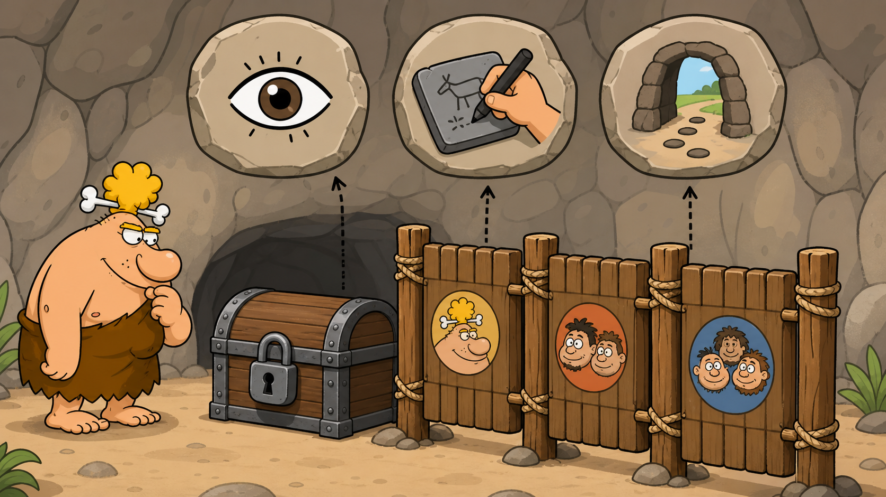

# 02 — Linux Permissions

## 🎯 Learning Objectives

By the end of this lesson, you will be able to:

- Read a Linux permission string from left to right.
- Explain owner, group, and others.
- Describe how read, write, and execute differ for files and directories.
- Predict which basic permission class Linux checks.

## 🏕️ Caveman Story

Chief Grog protects a treasure cave with three rule boards:

1. Rules for the treasure owner.
2. Rules for the owner's team.
3. Rules for everyone else.

Each board can grant three abilities: look at the treasure, change it, or pass through the entrance. The guard first decides which board applies to the visitor, then reads only that board.

Linux permissions work in exactly this order.

## 🖼️ Big Concept Illustration



```text
- rwx r-x r--
│ │   │   └── others: read only
│ │   └────── group: read and execute
│ └────────── owner: read, write, execute
└──────────── file type: regular file
```

```text
Identity → owner match? → group match? → others → applicable rwx rule
```

## 📖 Concept Explained Simply

Every basic Linux file permission has three audiences:

| Permission class | Caveman meaning | Linux meaning |
| --- | --- | --- |
| Owner (`u`) | Villager who owns the treasure | File's owning user |
| Group (`g`) | Owner's assigned team | File's owning group |
| Others (`o`) | Everyone else | Users in neither match |

Each audience can receive three permissions:

| Letter | File | Directory |
| --- | --- | --- |
| `r` — read | View file contents | List directory names |
| `w` — write | Change file contents | Create, rename, or remove entries inside |
| `x` — execute | Run the file as a program or script | Enter/traverse the directory and access known entries |

Directory permissions are especially important. Read and execute are different: seeing names is not the same as being able to reach them.

## 🌍 Real Linux Example

Consider a deployment script:

```text
-rwxr-x---  deploy  developers  deploy.sh
```

- `deploy` can read, edit, and run it.
- Members of `developers` can read and run it but cannot edit it.
- Everyone else receives no access from the basic mode.

Linux selects one class; it does not add owner, group, and others permissions together.

## 🛠️ Commands Introduced

### `ls -l` — Inspect Ownership and Permissions

`ls` appeared earlier as a navigation tool. It is deliberately revisited here because long format is the primary permission-reading view.

```bash
ls -l secure-file
```

Example output:

```text
-rwxr-xr-- 1 grog hunters 842 Jul 29 10:00 secure-file
│          │ │    │       │   │            └── name
│          │ │    │       │   └────────────── modification time
│          │ │    │       └────────────────── size
│          │ │    └────────────────────────── owning group
│          │ └─────────────────────────────── owner
│          └───────────────────────────────── link count
└──────────────────────────────────────────── type and permissions
```

Decode the first field:

```text
- | rwx | r-x | r--
    u      g      o
```

Common first characters include `-` for a regular file, `d` for a directory, and `l` for a symbolic link.

For a directory itself rather than its contents:

```bash
ls -ld project
```

`-d` asks `ls` to describe the directory entry. It is explained here because it prevents a common permission-inspection mistake.

## 💡 Caveman Tip

Split the mode into four pieces before interpreting it:

```text
type | owner | group | others
  -  |  rwx  |  r-x  |  ---
```

## ⚠️ Common Mistakes

- Reading all nine permission characters as one block.
- Assuming `x` has the same effect on files and directories.
- Thinking permissions from multiple classes are combined.
- Inspecting a directory's contents when you meant to inspect the directory itself.
- Assuming write permission on a file alone controls deletion; directory permissions govern removal of its name.

## 🧪 Hands-on Lab

### Mission: Read the Treasure Locks

1. Inspect a regular file in long format.
2. Separate its mode into type, owner, group, and others.
3. Name every granted and denied permission.
4. Inspect a directory itself with `ls -ld`.
5. Compare the meaning of `r`, `w`, and `x` for the file and directory.
6. Predict whether the owner, a group member, and an unrelated user could read or execute each resource.

### Engineer Challenge

Decode `drwxr-x---` without running anything. Explain what each class can do and why `d` is not a permission.

## 📝 Quick Recap

- Basic permissions have owner, group, and others classes.
- Each class can receive read, write, and execute.
- File and directory permissions have different effects.
- `ls -l` exposes the type, mode, owner, and group.
- Linux uses the matching class rather than combining all three.

## 🧠 Interview Questions

1. What do the ten characters in `-rwxr-xr--` represent?
2. What does execute permission mean on a directory?
3. Why can deletion depend on the parent directory's permissions?
4. Does Linux add group and others permissions together?
5. Why would you use `ls -ld`?

## 📚 What's Next

You can read the locks. Next, learn to change permissions and ownership safely in [03 — chmod, chown, and chgrp](03-chmod-chown-chgrp.md).
