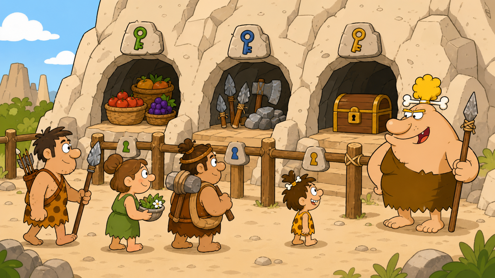

# 05 — Protecting the Treasure: Users and Permissions

## 🎯 Learning Objectives

By the end of this module, you will be able to:

- Explain how Linux identifies users and groups.
- Read file ownership and permission strings.
- Change permissions and ownership safely.
- Use administrative privileges without working as `root` unnecessarily.
- Apply ACLs when the normal owner/group/others model is not enough.

## 🏕️ Caveman Story

Chief Grog's village now has workers, a cave map, and useful tools. But an unprotected cave will soon lose its food.

The Chief creates rules:

- Every villager has an identity.
- Villagers belong to teams.
- Every treasure has an owner and a group.
- Locks decide who may look, change, or enter.
- Powerful keys are used only when necessary.

Linux protects files in the same way. Every file is treasure, every user is a villager, and every permission is a rule.

## 🖼️ Big Concept Illustration



```text
Villager → Team → Treasure → Lock → Access decision
  user      group      file    permission   allow or deny
```

```text
Village
   ├── Villagers
   ├── Groups
   ├── Protected treasure
   ├── Chief's authority
   └── Special access rules
```

## 📖 Concept Explained Simply

Linux does not ask only, “What do you want to do?” It also asks:

```text
Who are you?
     ↓
Which groups are you in?
     ↓
Who owns the resource?
     ↓
Which rule applies?
     ↓
Allow or deny
```

This module builds that decision one layer at a time. Permissions are not mysterious letters or numbers; they are Linux's way of protecting one user's work from another user, an application, or an accident.

## 🌍 Real Linux Example

On a web server, application code may be owned by a deployment account, read by the web-service group, and protected from every other user. Administrators use temporary privileged access for maintenance, while logs record what happened.

The same security model supports cloud servers, containers, CI/CD runners, database hosts, and AI infrastructure.

## 🛠️ Commands Introduced

| Lesson | Security question | New commands |
| --- | --- | --- |
| [01 — Users and Groups](01-users-and-groups.md) | Who am I, and which teams am I in? | `whoami`, `id`, `groups`, `users`, `finger` |
| [02 — Linux Permissions](02-linux-permissions.md) | What do these locks allow? | `ls -l` in the permission-reading context |
| [03 — Changing Permissions and Ownership](03-chmod-chown-chgrp.md) | How do I change the locks or owner? | `chmod`, `chown`, `chgrp` |
| [04 — Root and Sudo](04-root-and-sudo.md) | How should administrative power be used? | `sudo`, `su`, `passwd` |
| [05 — Access Control](05-access-control.md) | How do I grant a special exception? | `getfacl`, `setfacl`, `umask` |

Each command has one teaching home. Later lessons may reuse it for practice without explaining it again.

## 💡 Caveman Tip

When access fails, do not immediately add more permission. First identify the user, ownership, and exact permission class Linux will evaluate.

## ⚠️ Common Mistakes

- Giving everyone access because ownership is misunderstood.
- Treating `777` as a universal fix.
- Working as `root` for routine tasks.
- Changing an entire directory tree without checking its contents.
- Adding an ACL without noticing its effective mask.
- Testing permission changes on important production files.

## 🧪 Hands-on Lab

### Module Mission: Protect the Chief's Treasure

Across the five lessons, you will learn how to:

1. Identify villagers and their groups.
2. Inspect the locks on files and directories.
3. change ownership and permissions.
4. Perform an approved administrative task.
5. Grant and remove one exceptional ACL entry.

Use a disposable Linux VM. User and ownership administration can affect the whole system, so do not practise on a shared or production server.

## 📝 Quick Recap

```text
User
  ↓
Group
  ↓
Ownership
  ↓
Permission
  ↓
Privileged or special rule
  ↓
Secure access
```

Linux security begins with identity and follows predictable rules.

## 🧠 Interview Questions

1. Why does Linux separate users into groups?
2. How are ownership and permissions related?
3. Why is `sudo` preferable to remaining logged in as `root`?
4. When would an ACL be useful?
5. Why is least privilege safer than broad access?

## 📚 What's Next

Begin with [01 — Users and Groups](01-users-and-groups.md) to learn how Linux identifies every villager in the system.

## 🧭 Chapter Navigation

[← Finding Your Tools](../04-finding-your-tools%20-%20Learn%20Commands/README.md) · [Course Home](../README.md) · [Next: The Village Workers →](../06-the-village-workers-%20Processes%20and%20Services/README.md)
