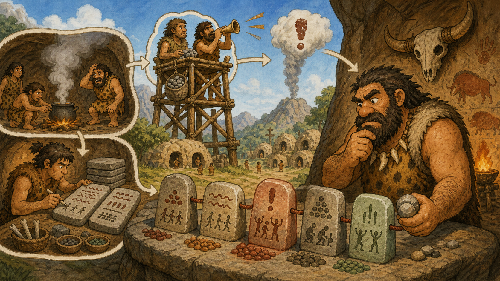

# 02 — Logs and Monitoring

> “If nobody records the smoke, tomorrow’s fire will look like a mystery.” — Chief Grog

## 🎯 Learning Objectives

- Distinguish logs, metrics, traces, events, dashboards, and alerts.
- Use timestamps and correlation context to build an incident timeline.
- Inspect kernel and file-based logs safely.
- Test log ingestion and understand rotation.
- Design alerts around user impact and actionable symptoms.

## 🏕️ Caveman Story

Chief Grog appoints record keepers and watchtower guards.

The record keepers write detailed events: who entered, what changed, and what failed. The guards count smoke, waiting carts, and closed gates. When danger grows, a horn alerts the right person.

A horn without records causes panic. Records without a watcher are discovered too late. The village needs both observation and action.

## 🖼️ Big Concept Illustration



```text
System and application
    ├── Logs   → detailed events
    ├── Metrics → measured behaviour over time
    ├── Traces  → one request across components
    └── Events  → deployments and configuration changes
                    ↓
             Dashboard → Alert → Engineer
```

## 📖 Concept Explained Simply

- **Logs** explain discrete events with context.
- **Metrics** are numeric time series suited to trends and alerts.
- **Traces** connect operations belonging to one distributed request.
- **Dashboards** visualise selected signals.
- **Alerts** notify people about conditions requiring action.

Good observability lets an engineer ask new questions without predicting every failure in advance. Monitoring checks known conditions. Production systems usually need both.

Useful records include accurate timestamps, severity, service, host, request or trace ID, outcome, and safe diagnostic context. Never log passwords, private keys, access tokens, or unnecessary personal data.

### Why Should I Care?

Without evidence, teams guess. With correlated logs, metrics, deployment events, and traces, an incident becomes a timeline that can be tested.

## 🌍 Real Linux Example

An alert reports an elevated HTTP error rate. Metrics show the increase began at 14:03, deployment events show a release at 14:01, application logs share a request ID with database timeouts, and traces locate the slow dependency. The alert found the symptom; the combined evidence guides the response.

Cloud platforms may ship signals to CloudWatch, Azure Monitor, or Google Cloud Operations. Kubernetes adds pod, node, event, and control-plane signals. AI inference services also monitor queue time, tokens per second, GPU memory, model-loading failures, and request quality indicators.

## 🛠️ Commands Introduced

`journalctl` was taught earlier with services and is deliberately reused for incident evidence. The commands below add log creation, kernel inspection, streaming, repeated observation, and rotation management.

### `logger` — Send a Test Message to the Logging System

```bash
logger -t caveman-lab "test log from server operations lab"
logger -p user.warning -t caveman-lab "simulated warning"
```

`-t` sets a tag and `-p` sets facility and priority. Use synthetic messages to validate the log pipeline without creating a real failure.

```bash
journalctl -t caveman-lab --since "5 minutes ago"
```

This supporting `journalctl` query confirms ingestion. Time filtering is essential on busy servers.

### `dmesg` — Inspect Kernel Messages

```bash
sudo dmesg --level=err,warn
sudo dmesg --ctime | tail -n 30
```

`--level` filters severity and `--ctime` renders human-readable timestamps. Access can be restricted. On systemd systems, `journalctl -k` is another view of kernel messages.

### `tail` — Read the End of a File Log

```bash
tail -n 50 /var/log/example.log
tail -F /var/log/example.log
```

`-n 50` prints recent lines. `-F` follows the filename across rotation and retries if it temporarily disappears. Stop streaming with `Ctrl+C`; do not follow noisy logs indefinitely.

### `watch` — Repeat a Short Observation

```bash
watch -n 2 'systemctl is-active nginx'
```

`-n 2` refreshes every two seconds. Use simple, low-cost checks; repeatedly executing expensive production queries can create load.

### `logrotate` — Validate Rotation Policy

```bash
sudo logrotate --debug /etc/logrotate.conf
sudo logrotate --verbose /etc/logrotate.conf
```

`--debug` evaluates without changing logs. `--verbose` performs normal processing with detail, so use it only after review. Do not force rotation casually; applications may need reopen or reload behaviour.

## 💡 Caveman Tip

Synchronise clocks and record timezone. A perfect log with the wrong timestamp can destroy an incident timeline.

## ⚠️ Common Mistakes

- Alerting on every unusual metric instead of actionable service risk.
- Searching all logs without a time window, host, service, or request ID.
- Treating an error message as proof of root cause.
- Logging secrets or sensitive customer data.
- Keeping logs forever without retention, cost, and privacy controls.
- Assuming file deletion immediately frees space when a process still holds it open.

## 🧪 Hands-on Lab

### Mission: Follow the Smoke Signal

1. Send an informational and warning message with `logger`.
2. Find both by tag, priority, and a five-minute time window.
3. Inspect recent kernel warnings without dumping the entire buffer.
4. Follow a disposable file log, rotate its filename in the lab, and observe `tail -F`.
5. Run `logrotate --debug` and identify one policy, retention count, and compression rule.
6. Design one symptom alert containing condition, duration, severity, owner, and runbook link.

## 📝 Quick Recap

```text
Signal appears → alert identifies risk → engineer checks timeline
       → logs + metrics + traces + changes → hypothesis → validation
```

## 🧠 Interview Questions

1. What is the difference between monitoring and observability?
2. When is a metric more useful than a log?
3. What context makes a production log actionable?
4. Why should alerts be based on duration as well as thresholds?
5. How does log rotation interact with a process that keeps a file open?

## 📚 What's Next

Observation tells us what changed. [03 — Packages and Patching](03-packages-and-patching.md) explains how to make planned software changes safely.
