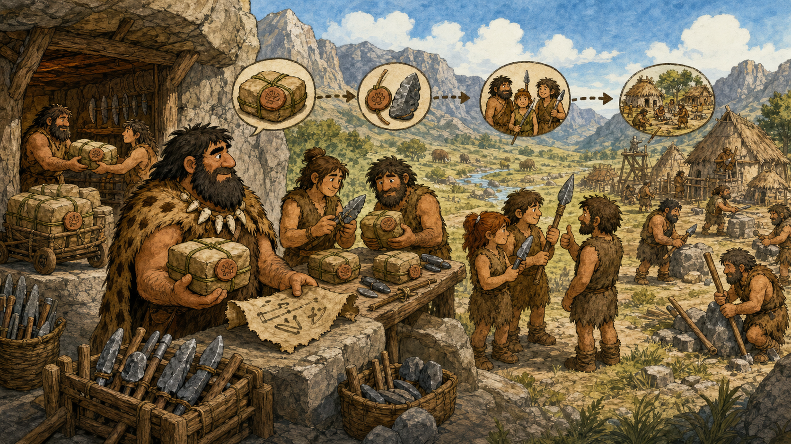

# 03 — Packages and Patching

> “A sharper spear is useful only when it fits the hunter’s hand and does not break the hunt.” — Chief Grog

## 🎯 Learning Objectives

- Explain packages, repositories, dependencies, signatures, and updates.
- Separate inventory, review, download, installation, and validation.
- Compare Debian-family and RPM-family package workflows.
- Plan patches around risk, maintenance windows, rollback, and reboot needs.
- Verify a change instead of assuming installation means success.

## 🏕️ Caveman Story

Village tools arrive from trusted workshops. Each bundle has a name, version, maker’s seal, and list of other parts it needs.

Chief Grog never replaces every tool during the busiest hunt. He checks the workshop, reads the change record, tests a sample, preserves a recovery path, changes one group at a time, and confirms that the hunters can still work.

Patching is maintenance under control—not blind updating.

## 🖼️ Big Concept Illustration



```text
Trusted repository → metadata/signature → dependency resolution → package install
                                                       ↓
Plan → test → back up/rollback → change → reboot if needed → validate → monitor
```

## 📖 Concept Explained Simply

A **package** contains software plus metadata. A **repository** publishes packages and signed metadata. A **package manager** resolves dependencies and records installed state.

Security patching reduces known risk, but every change can affect availability or compatibility. Production patching therefore needs:

1. Inventory and ownership.
2. Risk and vulnerability review.
3. Dependency and compatibility checks.
4. Tested backup, snapshot, or rollback strategy.
5. A maintenance plan and communication.
6. Installation in controlled groups.
7. Service, health, and business validation.
8. Monitoring and documentation.

A VM snapshot can support a short rollback, but it is not automatically an application-consistent backup. Database and distributed-system recovery requires workload-aware planning.

### Why Should I Care?

Unpatched servers accumulate known vulnerabilities. Uncontrolled patching can create outages. Production engineering balances security urgency with safe delivery.

## 🌍 Real Linux Example

A critical OpenSSL update affects a public service. The team confirms affected versions, tests the package in staging, reviews dependent processes, captures a recoverable backup, drains one instance from the load balancer, patches and restarts only what is required, validates TLS and business requests, then proceeds through the fleet in waves.

Cloud image pipelines often bake patched machine images and replace instances immutably. Containers are normally rebuilt from updated base images and redeployed rather than patched inside running containers.

## 🛠️ Commands Introduced

Choose the command family matching your distribution. Preview changes before confirming them, especially on remote or production systems.

### Debian and Ubuntu: `apt`, `apt-cache`, and `dpkg`

```bash
sudo apt update
apt list --upgradable
apt-cache policy nginx
sudo apt install --only-upgrade nginx
dpkg-query -W -f='${Package}\t${Version}\n' nginx
```

- `apt update` refreshes repository metadata; it does not install upgrades.
- `apt list --upgradable` reviews candidates.
- `apt-cache policy` shows installed and candidate versions plus sources.
- `--only-upgrade` prevents accidentally installing a package that is not present.
- `dpkg-query` reads the local package database.

For a full planned maintenance window:

```bash
sudo apt upgrade --dry-run
sudo apt upgrade
```

`--dry-run` previews the resolver plan. Review removals, held packages, configuration prompts, service restarts, and available disk space before the real change.

### RHEL, Fedora, and Related Systems: `dnf` and `rpm`

```bash
sudo dnf check-update
dnf info nginx
sudo dnf upgrade --refresh --assumeno
sudo dnf upgrade nginx
rpm -q nginx
```

- `check-update` reports available changes and may use exit code `100` when updates exist.
- `info` shows package metadata.
- `--assumeno` calculates and displays the transaction without accepting it.
- `rpm -q` queries installed package state.

Inspect transaction history with:

```bash
sudo dnf history list
sudo dnf history info TRANSACTION_ID
```

History is evidence, not a guaranteed rollback. Package downgrades cannot reverse data migrations or every configuration change.

### Check Whether a Reboot Is Recommended

```bash
test -f /var/run/reboot-required && cat /var/run/reboot-required
dnf needs-restarting -r
```

The first convention is common on Ubuntu. The second is available through DNF tooling on RPM-family systems. A kernel update is not active until the machine boots the new kernel.

## 💡 Caveman Tip

Patch in rings: lab, staging, canary, small production group, then wider fleet. Pause between rings long enough to observe real behaviour.

## ⚠️ Common Mistakes

- Running a full upgrade without reading the transaction plan.
- Trusting an unknown repository or disabling signature verification.
- Assuming a snapshot replaces a tested workload-aware backup.
- Ignoring configuration-file prompts and service restarts.
- Patching every instance simultaneously.
- Declaring success because the package manager returned zero.
- Forgetting that containers should usually be rebuilt and redeployed.

## 🧪 Hands-on Lab

### Mission: Safe Tool Maintenance

Use a disposable VM:

1. Identify the distribution and correct package family.
2. Refresh metadata and list available changes without installing them.
3. Select one low-risk package and inspect installed/candidate versions and source.
4. Write rollback and validation steps before the change.
5. Preview the transaction.
6. Apply the selected update during the lab window.
7. Verify package version, service health, relevant logs, and one user-facing function.
8. Determine whether a reboot is recommended and document the result.

## 📝 Quick Recap

```text
Inventory → assess → test → recovery plan → preview → patch in rings
          → restart/reboot when required → validate → monitor → record
```

## 🧠 Interview Questions

1. What is the difference between a package and a repository?
2. Why is refreshing metadata different from installing updates?
3. How would you patch a service behind a load balancer?
4. Why is package history not always a complete rollback mechanism?
5. How does patching a container differ from patching a VM?

## 📚 What's Next

Safe change requires a recovery path. [04 — Backups and Recovery](04-backups-and-recovery.md) turns stored copies into proven restoration capability.
