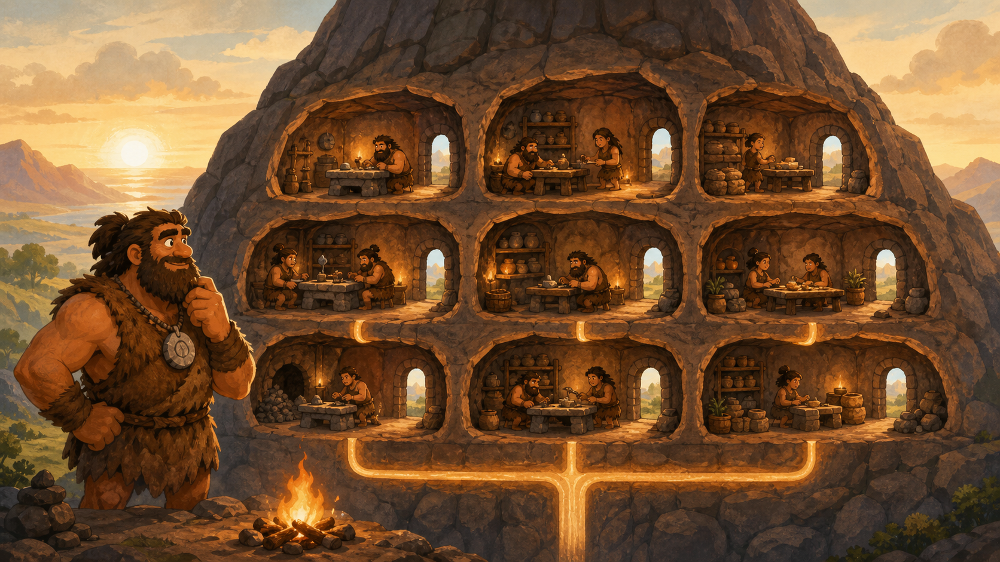

# 01 — Virtual Machines

> “Shared land works only when every family has clear walls, resources, and responsibilities.” — Chief Grog

## 🎯 Learning Objectives

- Explain virtualisation, hypervisors, hosts, and guests.
- Map virtual CPU, memory, disks, and network interfaces to physical resources.
- Distinguish virtual machines from physical servers and containers.
- Recognise common production benefits and limits of VMs.
- Inspect KVM/libvirt virtual machines without changing them.

## 🏕️ Caveman Story

Chief Grog owns one large stone plateau. Several families need private homes, but building a new mountain for each family is impossible.

The Chief appoints a land keeper. The keeper divides the plateau, gives each home its own rooms and doorway, and decides how much shared wood, water, and road access it receives.

Each family believes it has a complete home. Underneath, every home still shares the same physical land.

## 🖼️ Big Concept Illustration



```text
┌──────── VM 1 ────────┐  ┌──────── VM 2 ────────┐
│ App + Guest Linux    │  │ App + Guest Linux    │
│ vCPU + vRAM + vDisk  │  │ vCPU + vRAM + vDisk  │
└──────────┬───────────┘  └──────────┬───────────┘
           └──────── Hypervisor ─────┘
                Physical hardware
```

| Caveman world | Virtualisation |
| --- | --- |
| Stone plateau | Physical host |
| Land keeper | Hypervisor |
| Private home | Virtual machine |
| Allocated workers | vCPU |
| Allocated tables | Virtual memory |
| Private storage room | Virtual disk |

## 📖 Concept Explained Simply

A **virtual machine** is a software-defined computer with virtual hardware and its own operating system. The **host** supplies physical resources. The **hypervisor** creates and manages **guest** VMs.

- A **vCPU** is scheduled onto physical CPU time; it is not a dedicated physical core unless configured that way.
- Guest memory is backed by host memory and may be overcommitted according to platform policy.
- A virtual disk is usually a file, logical volume, or cloud block device presented as a disk.
- A virtual NIC connects through virtual switching to other systems.

Type 1 hypervisors run directly on hardware or as part of the host kernel. Type 2 products run through a general-purpose host operating system. KVM turns the Linux kernel into a hypervisor, while QEMU provides device emulation and libvirt supplies a management interface.

### Why Should I Care?

Virtual machines are the basic unit behind many cloud servers. Their isolation, snapshots, images, resource limits, and failure boundaries influence performance, security, cost, and recovery.

## 🌍 Real Linux Example

A physical KVM host runs separate VMs for a web service, a database, and a monitoring system. Each VM has its own Linux kernel and can reboot independently, but all three still depend on the host's CPU, memory, storage, network, and power.

AWS EC2 instances, Azure Virtual Machines, and Google Compute Engine instances expose the same guest-computer idea as an on-demand service. GPU VMs additionally pass through or partition accelerator resources for model training and inference.

## 🛠️ Commands Introduced

These examples use KVM and libvirt. Run inspection commands first; production lifecycle changes require an approved plan.

### `virt-host-validate` — Check Host Virtualisation Support

```bash
sudo virt-host-validate qemu
```

This checks whether the host has common requirements for QEMU/KVM virtualisation. A warning needs interpretation; it does not automatically mean VMs cannot run.

### `virsh` — Inspect the Hypervisor and Guests

```bash
sudo virsh -c qemu:///system list --all
sudo virsh -c qemu:///system dominfo VM_NAME
sudo virsh -c qemu:///system domifaddr VM_NAME
sudo virsh -c qemu:///system domblklist VM_NAME --details
```

- `-c qemu:///system` selects the system libvirt connection explicitly.
- `list --all` includes running and stopped domains.
- `dominfo` shows a guest's state and allocated resources.
- `domifaddr` attempts to discover guest addresses; availability depends on leases or a guest agent.
- `domblklist --details` maps guest disks to backing storage.

To access a configured serial console:

```bash
sudo virsh -c qemu:///system console VM_NAME
```

Use `Ctrl+]` to leave the default console session. A serial console must be configured inside the guest.

Graceful shutdown requests the guest operating system to stop:

```bash
sudo virsh -c qemu:///system shutdown VM_NAME
```

Do not confuse `shutdown` with `virsh destroy`, which immediately stops the VM like removing power and can corrupt data.

## 💡 Caveman Tip

Monitor both sides of the wall. A guest may report normal CPU while the physical host is overcommitted or its shared storage is saturated.

## ⚠️ Common Mistakes

- Treating a vCPU as a permanently dedicated physical core.
- Allocating all host memory and leaving none for the hypervisor.
- Assuming snapshots are application-consistent backups.
- Running too many busy guests on the same storage path.
- Using forced power-off when a graceful shutdown is possible.
- Forgetting that one host failure can affect many VMs.

## 🧪 Hands-on Lab

### Mission: Inspect the Shared Plateau

Use a disposable KVM/libvirt host or follow the same observations in your VM platform:

1. Identify the physical host, hypervisor, and one guest.
2. List active and inactive guests.
3. Record the guest's vCPU, memory, disk, network, and state.
4. Compare guest resources with physical host capacity.
5. Open and exit the serial console if it is configured.
6. Draw the path from a guest disk to its backing storage.
7. Explain which services would fail if the host stopped.

## 📝 Quick Recap

```text
Physical hardware → hypervisor → virtual hardware → guest OS → application
```

A VM isolates a complete operating system, but its resources and availability still depend on the physical host.

## 🧠 Interview Questions

1. What are the host, guest, and hypervisor?
2. How does a vCPU relate to a physical CPU?
3. Why might a healthy guest still perform badly on an overloaded host?
4. How are VM snapshots different from backups?
5. What is the difference between graceful shutdown and forced power-off?

## 📚 What's Next

Virtualisation divides one machine. [02 — Cloud Computing](02-cloud-computing.md) makes infrastructure available through APIs, regions, and on-demand services.
