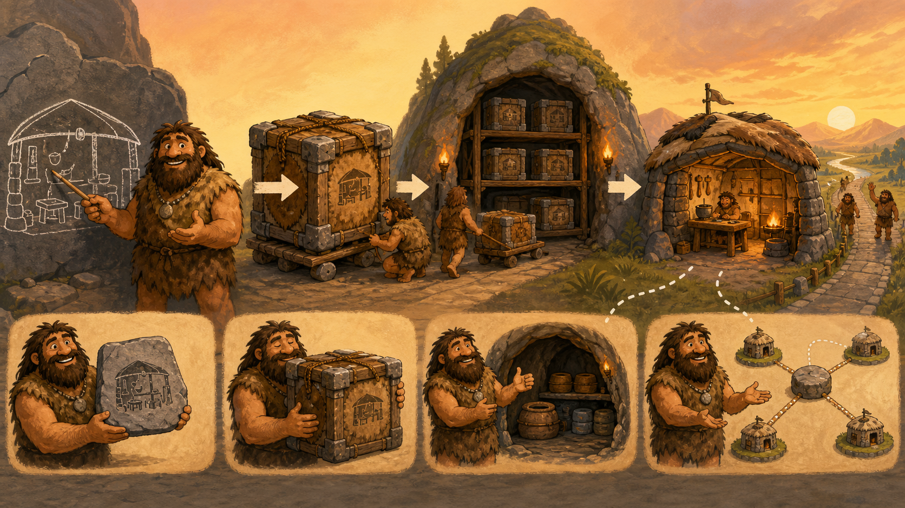

# 04 — Docker

> “A standard crate is useful only when we know what is inside, where it came from, and how to operate it.” — Chief Grog

## 🎯 Learning Objectives

- Explain Docker images, containers, registries, Dockerfiles, networks, and volumes.
- Pull, run, inspect, and troubleshoot a container safely.
- Build a small reproducible image.
- Use Compose to define a multi-container application.
- Apply production practices for image identity, secrets, persistence, and least privilege.

## 🏕️ Caveman Story

Chief Grog standardises the village's portable workshops.

Every crate follows one blueprint, receives a version mark, and is stored in a trusted warehouse. Workers can fetch the same crate, open it, inspect it, connect it to a road, and attach a durable storage room.

The crate is not the workshop's data, and its label is not proof of trust. Grog records the exact blueprint and checks every delivery.

## 🖼️ Big Concept Illustration



```text
Dockerfile → build → image → registry → pull → container
                                      ├── network
                                      ├── volume
                                      ├── limits
                                      └── logs
```

| Caveman system | Docker |
| --- | --- |
| Workshop blueprint | Dockerfile |
| Sealed versioned crate | Image |
| Open working crate | Container |
| Trusted warehouse | Registry |
| Durable storage cave | Volume |
| Workshop road | Container network |

## 📖 Concept Explained Simply

Docker provides an image format, build system, registry workflow, CLI, API, and runtime experience around containers.

- A **Dockerfile** describes image build steps.
- An **image** contains immutable filesystem layers and metadata.
- A **registry** stores and distributes images.
- A **container** runs the image's configured process with a writable layer.
- A **volume** stores data outside the container lifecycle.
- A **network** connects containers and published host ports.
- **Compose** defines related services, networks, and volumes in YAML.

Tags are mutable names. For controlled releases, record immutable image digests and provenance. Build images small, scan them, run as a non-root user, drop unnecessary privileges, and rebuild when base images receive security fixes.

### Why Should I Care?

Docker solves the “works on my machine” packaging problem only when the image is reproducible and its runtime configuration is explicit. Production failures often come from hidden state, unsafe privileges, mutable tags, missing limits, or misunderstood networking.

## 🌍 Real Linux Example

A CI pipeline builds an API image from a reviewed Dockerfile, scans it, signs or records provenance, pushes it to a registry, and deploys the immutable digest. Configuration arrives at runtime, secrets come from a protected secret store, and database data lives outside the container.

On a cloud VM, Docker may run a small service directly or through Compose. At larger scale, an orchestrator consumes the same OCI-style images. GPU containers require a compatible runtime integration, host driver, device allocation, and resource monitoring.

## 🛠️ Commands Introduced

Use a disposable Docker host. Image names below are examples; trust and pin approved sources in real environments.

### Pull and Run an Image

```bash
docker pull nginx:alpine
docker run --name cave-web --detach --publish 127.0.0.1:8080:80 --read-only nginx:alpine
```

- `pull` downloads image layers and metadata.
- `--name` assigns a readable container name.
- `--detach` runs in the background.
- `--publish 127.0.0.1:8080:80` binds host loopback port 8080 to container port 80.
- `--read-only` makes the container root filesystem read-only; not every image supports it without writable mounts.

### Observe and Diagnose

```bash
docker ps
docker ps --all
docker logs --tail 50 cave-web
docker inspect cave-web
docker stats --no-stream cave-web
docker exec cave-web nginx -t
```

- `ps --all` includes stopped containers.
- `logs --tail 50` limits output.
- `inspect` exposes detailed configuration and state; it may include sensitive environment data.
- `stats --no-stream` takes one resource snapshot.
- `exec` starts another process in a running container; it does not modify the image.

### Build a Versioned Image

```bash
docker build --tag cave-web:1.0 .
docker image inspect cave-web:1.0
```

`.` is the build context and may send files to the builder. Use `.dockerignore`, avoid copying secrets, pin dependencies, and keep the context small.

### Operate a Compose Application

```bash
docker compose config
docker compose up --detach --build
docker compose ps
docker compose logs --tail 50
docker compose down
```

`config` renders and validates the resolved model. `up` creates and starts services. `down` removes Compose containers and networks; named volumes remain unless explicitly requested, so read the plan before any cleanup.

Stop the disposable container gracefully, then remove it when finished:

```bash
docker stop --timeout 10 cave-web
docker rm cave-web
```

`stop` sends the configured stop signal and waits before forcing termination. `rm` then deletes the stopped container and its writable layer. Use both only for the verified lab container after confirming persistent data is elsewhere.

## 💡 Caveman Tip

Debug in this order: container state, exit code, logs, resolved configuration, network path, mounts, limits, and host health. Rebuild the image to make a permanent change.

## ⚠️ Common Mistakes

- Using `latest` as a production release identity.
- Baking credentials or private keys into image layers.
- Running everything as root or with `--privileged`.
- Publishing a port on every host interface unintentionally.
- Editing a running container and losing the change on replacement.
- Keeping databases only in the writable container layer.
- Sending large or secret-filled build contexts.
- Treating `docker exec` as a normal deployment method.

## 🧪 Hands-on Lab

### Mission: Package the Workshop

On a disposable Docker host:

1. Create a tiny static web page and a Dockerfile based on an approved small image.
2. Add a `.dockerignore` file.
3. Build the image with a versioned tag.
4. Run it on loopback using a non-conflicting high port.
5. Verify its state, logs, resolved configuration, resource snapshot, and response.
6. Stop and replace the container; confirm the image remains unchanged.
7. Describe where persistent data, configuration, and secrets should live.
8. Remove only the named lab resources.

## 📝 Quick Recap

```text
Source + Dockerfile → immutable image → registry → configured container
                                             ├── volume
                                             └── network
```

## 🧠 Interview Questions

1. How do Docker images and containers differ?
2. Why is an image digest stronger than a tag for release identity?
3. What belongs in an image, runtime configuration, secret store, and volume?
4. What is the difference between `docker run` and `docker exec`?
5. Why should a build context be small and protected?
6. When is Compose appropriate, and what does it not provide at cluster scale?

## 📚 What's Next

Docker operates containers on a host. [05 — Kubernetes](05-kubernetes.md) coordinates containerised applications across a cluster and continuously repairs drift.
