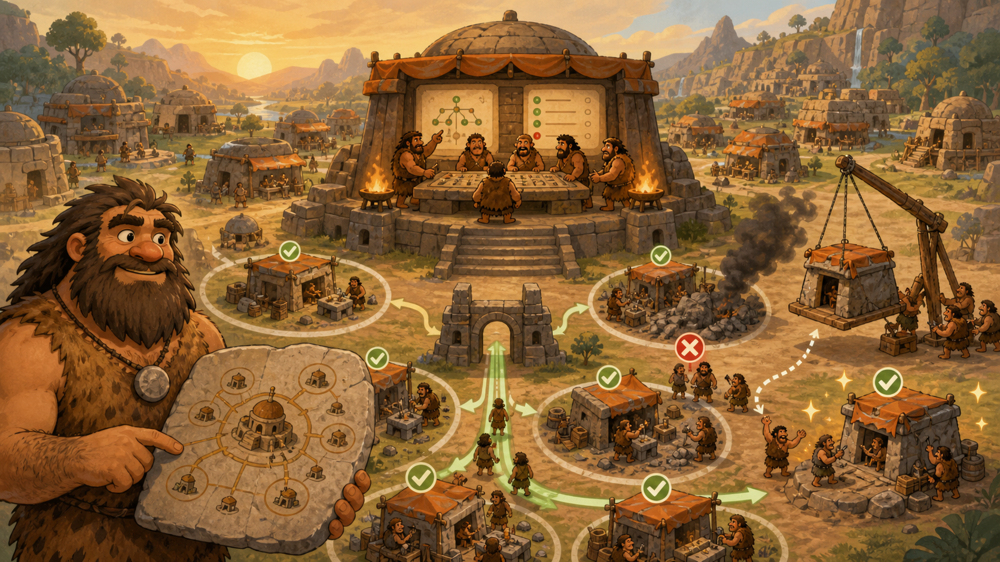

# 05 — Kubernetes

> “Do not tell every worker where to stand. Describe the healthy city, then let the coordinators keep it that way.” — Chief Grog

## 🎯 Learning Objectives

- Explain Kubernetes clusters, control planes, nodes, Pods, Deployments, and Services.
- Describe desired state and reconciliation.
- Deploy and observe a workload with `kubectl`.
- Follow a request from Service to Pod.
- Recognise production requirements for resources, probes, security, storage, and upgrades.

## 🏕️ Caveman Story

Chief Grog now manages thousands of portable workshops across many districts. Assigning each workshop by hand is impossible.

He writes the desired city state: three workshops must always be open, each needs food and memory, and citizens require one stable address.

City coordinators compare the plan with reality. If a workshop fails, they replace it. If demand grows, they add more. The plan remains the source of intent.

## 🖼️ Big Concept Illustration



```text
You submit desired state
          ↓
API server → stored cluster state
          ↓
Controllers → Scheduler → Nodes
                         └── Pods → Containers

Client → Service → ready Pod endpoints
```

| Caveman city | Kubernetes |
| --- | --- |
| Chief's city plan | Desired-state manifests |
| City office | Control plane |
| District | Worker node |
| Smallest workshop unit | Pod |
| Workshop manager | Deployment |
| Stable public counter | Service |
| Health inspection | Readiness/liveness probe |

## 📖 Concept Explained Simply

Kubernetes is a platform for orchestrating containerised workloads through declarative APIs.

- The **control plane** exposes the API, stores cluster state, schedules work, and runs controllers.
- A **node** is a worker machine that runs Pods.
- A **Pod** is the smallest deployable unit and contains one or more tightly coupled containers sharing network and storage context.
- A **Deployment** manages stateless Pod replicas and rolling updates.
- A **Service** provides a stable virtual address over a changing set of ready Pods.
- **ConfigMaps** hold non-secret configuration; **Secrets** hold sensitive values but still require encryption and access controls.
- **PersistentVolumes** connect workloads to durable storage.

Kubernetes constantly compares desired state with observed state. This **reconciliation loop** replaces failed Pods, adjusts replicas, and progresses rollouts. It does not fix broken application logic or guarantee that data is safe.

### Why Should I Care?

Kubernetes changes the unit of operations from individual servers to declared workloads and controllers. Engineers must understand both the abstraction and the Linux nodes beneath it when scheduling, networking, storage, or resource isolation fails.

## 🌍 Real Linux Example

A Deployment declares three API replicas. A Service selects their labels and sends traffic only to ready endpoints. During an update, Kubernetes creates new Pods and removes old ones according to rollout policy. If a node fails, replacement Pods are scheduled elsewhere when capacity and dependencies permit.

Managed services such as EKS, AKS, and GKE operate parts of the control plane, but customers still own workload configuration, identity, network policy, resources, application health, data protection, and often node choices. AI clusters add GPU scheduling, device plugins, large model images, persistent caches, and expensive capacity constraints.

## 🛠️ Commands Introduced

Use a disposable lab cluster and verify context before every change.

### Confirm the Target Cluster

```bash
kubectl config current-context
kubectl cluster-info
kubectl get nodes -o wide
```

The current context selects cluster, user, and namespace defaults. A correct command against the wrong context is still a serious incident.

### Apply Desired State

```bash
kubectl apply -f app.yaml
kubectl get deployment,pods,service
kubectl rollout status deployment/cave-web --timeout=120s
```

- `apply -f` creates or updates resources from the manifest.
- `get` shows current summaries.
- `rollout status` waits for the Deployment rollout rather than assuming success.

### Investigate Workloads

```bash
kubectl get pods -o wide
kubectl describe pod POD_NAME
kubectl logs POD_NAME --tail=100
kubectl logs POD_NAME --previous --tail=100
```

- `-o wide` adds placement and address details.
- `describe` shows configuration, conditions, and recent events.
- `logs --previous` reads the preceding container instance after a restart when retained.

For a multi-container Pod, select a container explicitly:

```bash
kubectl logs POD_NAME --container CONTAINER_NAME --tail=100
kubectl exec POD_NAME --container CONTAINER_NAME -- COMMAND
```

Use `exec` for narrow diagnosis, not as a deployment or configuration method. Production images may intentionally omit shells and debugging tools.

Clean up only the disposable lab objects described by the manifest:

```bash
kubectl delete -f app.yaml
```

Deletion is a state-changing action. Confirm context, namespace, file content, data ownership, and recovery requirements first.

## 💡 Caveman Tip

For a failing application, follow the chain: context → resource status → events → Pod conditions → logs → Service selector → endpoints → node and dependencies.

## ⚠️ Common Mistakes

- Running commands against the wrong context or namespace.
- Treating a Pod as a permanent server.
- Omitting CPU/memory requests, limits, and health probes.
- Using matching labels incorrectly and leaving a Service without endpoints.
- Editing live resources without updating version-controlled manifests.
- Storing sensitive values casually because the object is named Secret.
- Assuming more replicas protect stateful data automatically.
- Debugging only Kubernetes while ignoring the Linux node or external dependency.

## 🧪 Hands-on Lab

### Mission: Let the City Reconcile

Use a prepared disposable cluster:

1. Confirm the current context and inspect nodes.
2. Create a manifest containing a Deployment with two replicas and a Service.
3. Add resource requests and readiness/liveness probes.
4. Apply the manifest and wait for rollout completion.
5. Follow labels from Service selector to ready Pods.
6. Inspect one Pod's events, logs, node placement, and configuration.
7. Delete one Pod and observe the Deployment restore desired replica count.
8. Remove the lab manifest only after verifying the target context and namespace.

## 📝 Quick Recap

```text
Manifest → API → desired state → controllers → scheduled Pods
                       ↑                    ↓
                       └── observe and reconcile
```

## 🧠 Interview Questions

1. What is a Pod, and why is it not simply a container?
2. What does the Kubernetes reconciliation loop do?
3. How do Deployments and Services solve different problems?
4. What is the difference between readiness and liveness?
5. How would you investigate a Service with no reachable backends?
6. What responsibilities remain with users of a managed Kubernetes service?

## 📚 What's Next

Kubernetes manifests describe workloads. [06 — Infrastructure as Code](06-infrastructure-as-code.md) expands declarative, reviewable change to networks, clusters, identities, and cloud services.
