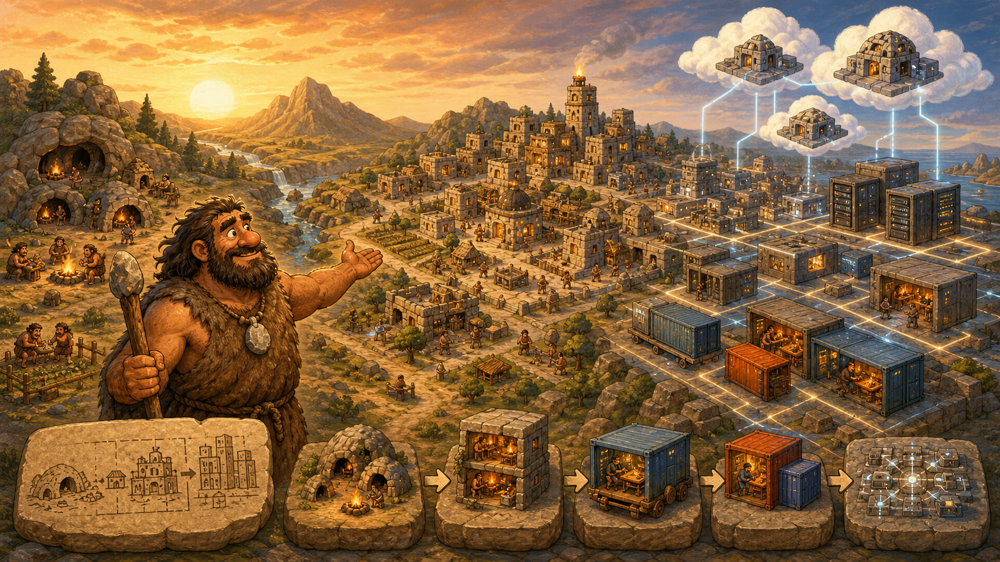

# 09 — Building Modern Cities: Cloud, Containers, and Kubernetes

> “A village can survive with one Chief. A modern city needs repeatable plans, specialised districts, and coordination at scale.” — Chief Grog

## 🎯 Learning Objectives

By the end of this module, you will be able to:

- Explain how virtual machines divide physical hardware into isolated computers.
- Describe cloud computing through on-demand resources and shared responsibility.
- Connect Linux namespaces and cgroups to container isolation.
- Build, run, inspect, and troubleshoot Docker workloads.
- Explain how Kubernetes keeps containerised applications in a desired state.
- Use infrastructure as code to plan reproducible infrastructure changes.

## 🏕️ Caveman Story

Chief Grog's village has grown beyond one cave. New families arrive, services multiply, and distant villages request help.

Building every home by hand no longer works. Grog creates reusable house plans, rents land when demand grows, packs workshops into portable units, appoints city coordinators, and records the whole city as code.

The cave has become a modern city—but Linux still runs underneath it.

## 🖼️ Big Concept Illustration



```text
Physical server
      ↓
Virtual machines
      ↓
Cloud infrastructure
      ↓
Containers → Docker
      ↓
Kubernetes
      ↓
Infrastructure as Code
```

```text
Cave → Village → Town → City → Cloud-connected city
Linux remains the foundation at every stage
```

## 📖 Concept Explained Simply

Modern infrastructure is a set of layers, not a collection of competing technologies.

| Lesson | City idea | Engineering outcome |
| --- | --- | --- |
| [01 — Virtual Machines](01-virtual-machines.md) | Several private homes on shared land | Isolated operating systems on one host |
| [02 — Cloud Computing](02-cloud-computing.md) | Rent city resources on demand | Elastic, API-driven infrastructure |
| [03 — Containers](03-containers.md) | Portable workshops | Isolated processes sharing a kernel |
| [04 — Docker](04-docker.md) | Standard workshop crates | Build and operate container images |
| [05 — Kubernetes](05-kubernetes.md) | Automated city coordinator | Schedule, recover, and scale workloads |
| [06 — Infrastructure as Code](06-infrastructure-as-code.md) | Versioned city blueprint | Reviewable and repeatable infrastructure |

### Why Should I Care?

Most modern applications combine these layers. A cloud VM may run Linux, Docker may package the application, Kubernetes may coordinate its replicas, and Terraform may create the surrounding network and cluster. Understanding the boundaries makes failures easier to diagnose and designs easier to improve.

## 🌍 Real Linux Example

A team deploys an API to several containers. Kubernetes spreads replicas across Linux worker nodes, replaces failed instances, and exposes the service. The nodes are cloud virtual machines, while infrastructure code defines the network, cluster, and permissions.

The same pattern supports websites, banking services, data platforms, CI workers, and GPU-backed AI inference. The scale changes; the layers remain recognisable.

## 🛠️ Commands Introduced

| Lesson | Commands taught here |
| --- | --- |
| Virtual Machines | `virt-host-validate`, `virsh` |
| Cloud Computing | `cloud-init status`, `query`, `analyze`, `schema`, `collect-logs` |
| Containers | `lsns`, `unshare`, `nsenter`, `systemd-cgls`, `systemd-cgtop` |
| Docker | `docker pull`, `run`, `ps`, `logs`, `exec`, `inspect`, `stats`, `build`, `compose` |
| Kubernetes | `kubectl config`, `cluster-info`, `get`, `apply`, `describe`, `logs`, `rollout`, `delete` |
| Infrastructure as Code | `terraform init`, `fmt`, `validate`, `plan`, `show`, `apply`, `output`, `state list` |

Earlier Linux commands reappear only when they provide supporting evidence inside a real workflow. Each new command is taught in its owning lesson.

## 💡 Caveman Tip

Always ask which layer owns the problem. An application error, container limit, Kubernetes policy, VM failure, and cloud network rule can produce similar symptoms but require different evidence.

## ⚠️ Common Mistakes

- Treating virtual machines and containers as the same isolation model.
- Assuming “cloud” automatically means highly available or inexpensive.
- Storing important data inside an ephemeral container filesystem.
- Using mutable tags such as `latest` for controlled production releases.
- Editing live Kubernetes objects without updating their source configuration.
- Applying infrastructure code without reviewing the plan or protecting state.

## 🧪 Hands-on Lab

### Module Mission: Build a Small Modern City

Use disposable local or cloud lab resources:

1. Inspect a Linux virtual machine and identify its virtual CPU, memory, disk, and network boundaries.
2. Review how `cloud-init` configured the instance at first boot.
3. Observe a process namespace and its cgroup placement.
4. Build and run a small Docker web application.
5. Deploy the image to a prepared local Kubernetes cluster.
6. Describe one infrastructure component as code and review its plan.
7. Draw the complete request path from user to container process.

Keep the lab isolated from production and remove chargeable cloud resources when finished.

## 📝 Quick Recap

```text
VMs isolate operating systems
Cloud provides resources on demand
Containers package isolated processes
Docker builds and runs containers
Kubernetes coordinates them at scale
Infrastructure as Code makes the platform repeatable
```

## 🧠 Interview Questions

1. How is a virtual machine different from a container?
2. What does cloud computing add beyond ordinary virtualisation?
3. Why do containers still depend on the Linux kernel?
4. What problem does Kubernetes solve that Docker alone does not?
5. Why must infrastructure code and state be protected?
6. How would you find which layer caused a failed request?

## 📚 What's Next

Begin with [01 — Virtual Machines](01-virtual-machines.md) and learn how Chief Grog creates several isolated homes on one physical machine.

## 🧭 Chapter Navigation

[← Running the Village](../08-running-the-village-operateServers/README.md) · [Course Home](../README.md) · [Next: Teaching the City to Think →](../10-teaching-the-city-to-think%20-%20Understand%20AI%20Infra/README.md)
