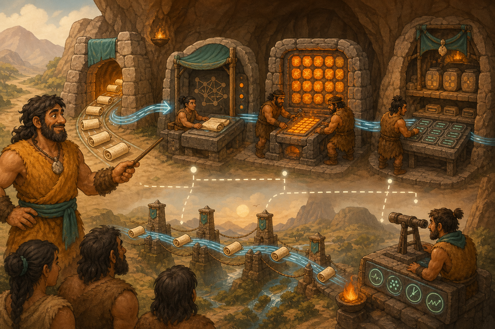

# 01 — What Is AI Infrastructure?

> “The thinking stone gives answers only because an entire village carries, feeds, protects, and watches it.” — Chief Grog

## 🎯 Learning Objectives

- Define AI infrastructure in practical terms.
- Separate training, inference, and retrieval workloads.
- Trace the major components behind an AI response.
- Recognise compute, memory, storage, network, platform, and operations dependencies.
- Inspect basic hardware topology on a Linux AI host.

## 🏕️ Caveman Story

Chief Grog receives a magical stone that can answer questions. The villagers celebrate—until the first hundred people arrive at once.

The stone needs a forge to compute, a large table for active work, a vault for its knowledge, fast roads for requests, guards for access, and a lookout to detect delays. Grog realises the stone is only one worker inside a much larger system.

That complete system is the city's **AI infrastructure**.

## 🖼️ Big Concept Illustration



```text
Client
  ↓
Gateway → Queue → Model server → Accelerator
              ↘        ↕             ↕
               Retrieval          GPU memory
                   ↕                 ↕
             Vector database    Model artifacts
                       \          /
                    Metrics, logs, traces
```

| Caveman city | AI infrastructure |
| --- | --- |
| Question scroll | Request or prompt |
| Thinking stone | AI model |
| Compute forge | CPU/GPU accelerator |
| Working tables | RAM/VRAM |
| Knowledge vault | Object or model storage |
| Public counter | Model-serving API |
| Fast road | Network fabric |
| Guard | Identity and policy |
| Lookout | Observability |

## 📖 Concept Explained Simply

AI infrastructure supplies the resources and services that develop, deploy, and operate AI workloads.

- **Training** learns model parameters from data. It is compute-heavy, long-running, and often distributed.
- **Inference** uses a trained model to answer new requests. It is usually sensitive to latency, throughput, availability, and cost.
- **Retrieval** finds external context, often through embeddings and a vector database, before generation.
- **Compute** includes CPUs and accelerators such as GPUs.
- **Memory and storage** hold active tensors, caches, datasets, checkpoints, and model weights.
- **Networking** moves requests and, in multi-GPU systems, large volumes of model data.
- **Platform software** includes Linux, drivers, runtimes, containers, schedulers, and serving engines.
- **Operations** includes security, monitoring, scaling, deployment, governance, and recovery.

### Why Should I Care?

Most AI incidents are system incidents: exhausted GPU memory, full queues, missing model files, incompatible drivers, slow storage, unreachable retrieval services, or unbounded traffic. Seeing the whole stack prevents narrow diagnosis.

## 🌍 Real Linux Example

A RAG assistant runs on Linux worker nodes. Kubernetes schedules a model-serving Pod onto a GPU node. Model weights load from object storage into local disk, system RAM, and then GPU memory. The service retrieves relevant company documents from a vector database and streams generated tokens to the client.

In production, capacity planning must consider model size, numerical precision, context length, concurrent requests, cache size, interconnects, and failure domains—not GPU count alone.

## 🛠️ Commands Introduced

These read-only commands inspect how compute devices are connected. GPU-specific commands require a supported NVIDIA driver and hardware.

### Find Accelerator Hardware

```bash
lspci -nn | grep -Ei 'vga|3d|display'
```

- `lspci` lists PCI devices.
- `-nn` shows both readable names and numeric vendor/device IDs.
- The filter narrows the output to display and accelerator-class devices.

### Inspect NUMA Layout

```bash
numactl --hardware
```

NUMA describes which CPUs and memory banks are physically closer. On large AI hosts, poor CPU, GPU, NIC, and memory placement can reduce data-transfer performance. The command may require the `numactl` package.

### Inspect GPU Topology

```bash
nvidia-smi topo -m
```

The matrix shows connections among GPUs and eligible network devices plus CPU/memory affinity. Links such as PCIe and NVLink do not have equal bandwidth, so topology matters for multi-GPU workloads.

These inventory commands belong here because this lesson introduces the system as connected infrastructure. Detailed utilisation inspection comes next.

## 💡 Caveman Tip

Draw the data path before sizing hardware. Compute that waits for storage, networking, or memory is expensive idle capacity.

## ⚠️ Common Mistakes

- Calling only the GPU “AI infrastructure.”
- Mixing training and inference requirements.
- Selecting hardware from model parameter count alone.
- Ignoring NUMA, PCIe, GPU-to-GPU, and GPU-to-NIC topology.
- Assuming installed hardware means drivers and runtimes are compatible.
- Leaving model artifacts, prompts, and retrieved data outside the security model.

## 🧪 Hands-on Lab

### Mission: Map the Thinking Workshop

On a disposable Linux host or provided output sample:

1. Draw an inference path from request to response.
2. Run the PCI inventory and identify any accelerator-class device.
3. Inspect NUMA nodes and note CPU and memory placement.
4. If NVIDIA GPUs exist, inspect their topology matrix.
5. Mark where model weights live before and during inference.
6. List one possible bottleneck at every layer.
7. Explain which evidence would confirm each bottleneck.

## 📝 Quick Recap

```text
Data + Model
    ↓
Compute ↔ Memory ↔ Storage ↔ Network
    ↓
Serving + Security + Observability
    ↓
Reliable AI service
```

## 🧠 Interview Questions

1. What is AI infrastructure?
2. How do training and inference infrastructure differ?
3. Why can topology affect multi-GPU performance?
4. Where do model weights move during startup?
5. What infrastructure components participate in a RAG request?
6. Why is a powerful GPU not sufficient for a reliable AI service?

## 📚 What's Next

The city needs different kinds of workers. [02 — CPU vs GPU](02-cpu-vs-gpu.md) explains which work belongs to each and why memory location matters.
