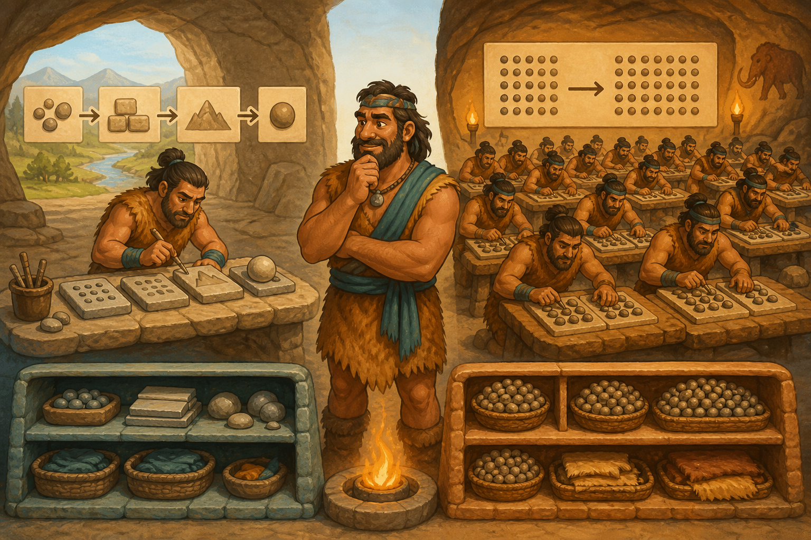

# 02 — CPU vs GPU

> “One expert can solve many kinds of problems. A coordinated team can repeat one kind of calculation at enormous speed.” — Chief Grog

## 🎯 Learning Objectives

- Compare CPU and GPU design goals.
- Distinguish cores, threads, system RAM, and GPU memory.
- Explain parallelism, data movement, and accelerator utilisation.
- Match common AI tasks to CPU and GPU roles.
- Inspect CPU and NVIDIA GPU resources safely.

## 🏕️ Caveman Story

Chief Grog has one experienced worker who can plan routes, resolve disputes, and switch between different jobs. This worker is excellent at complex sequences.

Nearby, hundreds of workers each perform the same simple stone calculation at once. Together they finish a huge repeated task quickly—but they still need instructions, supplies, and coordination from the expert worker.

The expert is the **CPU**. The parallel team is the **GPU**.

## 🖼️ Big Concept Illustration



```text
CPU                              GPU
Few powerful cores               Many parallel compute units
Complex control flow             Repeated numeric operations
OS, preprocessing, orchestration Matrix and tensor computation
Uses system RAM                  Uses GPU memory (VRAM/HBM)

CPU RAM ── data transfer ── GPU memory
```

| Caveman concept | Hardware concept |
| --- | --- |
| Versatile expert workers | CPU cores |
| Large coordinated worker team | GPU compute units |
| Main working hall | System RAM |
| Fast tables beside the forge | GPU memory |
| Narrow bridge between halls | PCIe data transfer |
| Fast forge-to-forge bridge | GPU interconnect |

## 📖 Concept Explained Simply

A **CPU** is designed for flexible, low-latency execution across varied tasks. It runs Linux, application logic, networking, tokenisation, scheduling, and data preparation.

A **GPU** is designed for high-throughput parallel work. AI workloads use it because matrix and tensor operations contain many calculations that can run together.

Memory is equally important:

- **System RAM** is directly available to the CPU.
- **GPU memory**—often called VRAM or HBM—holds model weights, activations, and caches close to GPU compute.
- Data crossing between system RAM and GPU memory costs time and bandwidth.
- A model can fail with an out-of-memory error even when system RAM is plentiful, because GPU memory is a separate capacity.

The CPU and GPU are partners, not replacements for one another.

### Why Should I Care?

AI capacity and cost depend on choosing the right worker. A GPU may accelerate dense parallel computation, but poor batching, slow preprocessing, insufficient memory, or frequent transfers can leave it waiting.

## 🌍 Real Linux Example

During LLM inference, the CPU accepts HTTP requests and tokenises text. Model weights and the key-value cache occupy GPU memory. The GPU calculates the next-token probabilities. The CPU coordinates results and networking while the serving engine schedules new work.

For small or low-volume models, CPU inference may be simpler and cheaper. For large or high-throughput workloads, GPUs are often required. Benchmark the actual model and traffic pattern before choosing.

## 🛠️ Commands Introduced

These commands are read-only. NVIDIA commands require the appropriate driver.

### Inspect the CPU

```bash
lscpu
lscpu --extended
```

- `lscpu` summarises architecture, sockets, cores, threads, caches, and NUMA placement.
- `--extended` shows a per-logical-CPU view. Core and socket topology help explain available parallelism.

### Identify GPUs

```bash
nvidia-smi -L
```

`-L` lists detected GPUs with stable UUIDs. Index ordering may change after reboot, so production automation should prefer UUIDs or PCI bus IDs where practical.

### Query Capacity and Current Use

```bash
nvidia-smi --query-gpu=index,name,uuid,memory.total,memory.used,utilization.gpu,temperature.gpu,power.draw --format=csv
```

The selected fields show identity, memory pressure, compute activity, temperature, and power. Unsupported fields may report `N/A`.

### Watch Device and Process Activity

```bash
nvidia-smi dmon -s pucm
nvidia-smi pmon
```

- `dmon` samples device power, utilisation, clocks, and memory-related groups.
- `pmon` attributes supported GPU activity to processes.
- Stop interactive monitoring with `Ctrl+C`.

These commands diagnose hardware behaviour here. Later lessons may reuse selected metrics only to correlate them with request-level evidence.

## 💡 Caveman Tip

Low GPU utilisation is a clue, not a verdict. Check whether the GPU is waiting for requests, CPU preprocessing, data transfer, storage, synchronisation, or another GPU.

## ⚠️ Common Mistakes

- Saying a GPU is simply a “faster CPU.”
- Confusing system RAM with GPU memory.
- Treating core counts from different architectures as directly comparable.
- Assuming 100% GPU utilisation always means efficient useful work.
- Ignoring batching, numerical precision, context length, and cache growth.
- Choosing hardware from a synthetic benchmark that does not match production traffic.

## 🧪 Hands-on Lab

### Mission: Assign the Right Workers

1. Inspect CPU sockets, cores, threads, and NUMA nodes.
2. If an NVIDIA GPU is present, list its model and UUID.
3. Record total and used GPU memory at idle.
4. Run a prepared small inference workload and observe device monitoring.
5. Compare GPU utilisation with per-process activity.
6. Classify tokenisation, HTTP handling, matrix multiplication, and model-cache storage by resource.
7. Explain why an idle GPU may still contain allocated memory.

## 📝 Quick Recap

```text
CPU → flexible control, Linux, requests, preprocessing
GPU → parallel tensor computation
RAM → CPU working memory
GPU memory → nearby model and inference working memory
Performance → compute + memory + movement + scheduling
```

## 🧠 Interview Questions

1. Why are GPUs useful for AI workloads?
2. How does GPU memory differ from system RAM?
3. What usually remains on the CPU during GPU inference?
4. Why can data transfer reduce accelerator performance?
5. What does low GPU utilisation tell you—and not tell you?
6. How would you size hardware for an inference workload?

## 📚 What's Next

Compute becomes useful when users can reach it reliably. [03 — AI Model Serving](03-ai-model-serving.md) turns a loaded model into an operated network service.
