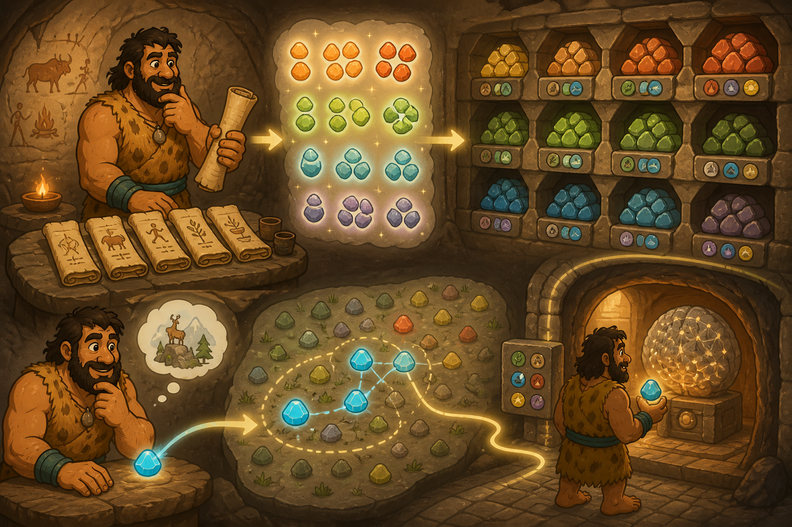

# 04 — Vector Databases

> “Do not search every scroll for the same words. Store meanings close together, then look near the question.” — Chief Grog

## 🎯 Learning Objectives

- Explain embeddings, vectors, similarity, collections, points, and payloads.
- Describe the retrieval stage of retrieval-augmented generation (RAG).
- Distinguish vector search from a model's built-in knowledge.
- Create, populate, inspect, query, and remove a disposable Qdrant collection.
- Recognise production concerns involving dimensions, filtering, indexing, security, and evaluation.

## 🏕️ Caveman Story

Chief Grog's archive contains thousands of scrolls. Exact word matching fails: a hunter asks for “warm clothing,” but the useful scroll says “winter fur.”

The archivist gives every scroll a pattern of stones representing its meaning. Similar meanings are placed near one another. A new question receives its own pattern, and the archivist finds the closest stored patterns.

The archive has become a **vector database**.

## 🖼️ Big Concept Illustration



```text
Document → Chunk → Embedding model → Vector + metadata
                                      ↓
                                Vector database

Question → Embedding model → Query vector
                                      ↓
                         Similarity + filters
                                      ↓
                        Relevant chunks → LLM
```

| Caveman archive | Vector system |
| --- | --- |
| Scroll section | Chunk |
| Meaning pattern | Embedding vector |
| Archive room | Collection |
| Stored stone record | Point |
| Coloured tag | Payload metadata |
| Nearby patterns | Similar results |
| Archive rules | Filters and access policy |

## 📖 Concept Explained Simply

An **embedding model** converts content into a vector: an ordered list of numbers. Content with related meaning should produce nearby vectors under the distance measure used by that model.

A vector database stores and searches these representations:

- A **collection** groups points with a vector configuration.
- A **point** contains an identifier, one or more vectors, and optional payload metadata.
- **Dimensions** are the vector's length and must match the collection configuration.
- A **distance metric** such as cosine, dot product, or Euclidean distance defines closeness.
- **Payload filters** restrict results by metadata such as tenant, document type, or access scope.
- An approximate nearest-neighbour index speeds search at scale, usually trading a small amount of recall for performance.

In RAG, retrieved text is placed into the model's input context. The vector database does not train the LLM, guarantee truth, or automatically enforce permissions.

### Why Should I Care?

Vector retrieval connects AI systems to current, private, or domain-specific knowledge without retraining the model for every document change. Poor chunking, embeddings, filters, or evaluation can still return confident but irrelevant context.

## 🌍 Real Linux Example

A support service divides approved manuals into chunks, produces embeddings, and writes vectors plus source and access metadata to Qdrant. At query time, it embeds the question, applies the caller's access filter, retrieves top candidates, and passes only the allowed text to the LLM.

Production systems must version the embedding model and schema together. Changing models may change vector dimensions and meaning, requiring controlled re-embedding and migration.

## 🛠️ Commands Introduced

These examples use a local disposable Qdrant instance at `127.0.0.1:6333`. The two-dimensional vectors are for learning only, not useful semantic embeddings.

### Create a Collection

```bash
curl --fail --silent --show-error \
  -X PUT http://127.0.0.1:6333/collections/cave_notes \
  -H 'Content-Type: application/json' \
  -d '{"vectors":{"size":2,"distance":"Cosine"}}'
```

The collection requires vectors of size two and compares them using cosine similarity.

### Upsert Sample Points

```bash
curl --fail --silent --show-error \
  -X PUT 'http://127.0.0.1:6333/collections/cave_notes/points?wait=true' \
  -H 'Content-Type: application/json' \
  -d '{"points":[
    {"id":1,"vector":[0.95,0.05],"payload":{"topic":"linux","text":"Linux manages system resources."}},
    {"id":2,"vector":[0.10,0.90],"payload":{"topic":"network","text":"DNS maps names to addresses."}},
    {"id":3,"vector":[0.85,0.15],"payload":{"topic":"linux","text":"The kernel coordinates hardware."}}
  ]}'
```

`upsert` inserts new IDs or replaces existing ones. `wait=true` waits for the update result instead of returning immediately.

### Query Nearby Points

```bash
curl --fail --silent --show-error \
  -X POST http://127.0.0.1:6333/collections/cave_notes/points/query \
  -H 'Content-Type: application/json' \
  -d '{"query":[0.90,0.10],"filter":{"must":[{"key":"topic","match":{"value":"linux"}}]},"limit":2,"with_payload":true}'
```

The query combines vector similarity with a payload filter. In a real application, the same embedding model must produce both stored and query vectors.

### Inspect and Remove the Lab Collection

```bash
curl --fail --silent --show-error http://127.0.0.1:6333/collections/cave_notes
curl --fail --silent --show-error -X DELETE http://127.0.0.1:6333/collections/cave_notes
```

The first call verifies collection state. The second permanently deletes the named lab collection and its points; run it only against this disposable target after checking the URL.

`curl` reappears because REST is the operational interface being learned here, not as a repeat of generic command syntax.

## 💡 Caveman Tip

Evaluate retrieval separately from generation. If the correct source never reaches the model, prompt tuning cannot recover it reliably.

## ⚠️ Common Mistakes

- Mixing vectors from incompatible embedding models.
- Creating a collection with the wrong dimensions or distance metric.
- Retrieving across users without payload filters and authorisation.
- Storing a whole document as one giant chunk.
- Assuming nearest means relevant or correct.
- Updating documents without removing stale vectors.
- Logging sensitive vectors, payloads, queries, or retrieved content casually.

## 🧪 Hands-on Lab

### Mission: Build the Meaning Archive

1. Start with a prepared disposable local Qdrant service.
2. Create the `cave_notes` collection.
3. Upsert the three sample points.
4. Query near `[0.90, 0.10]` with and without the topic filter.
5. Change `limit` and compare the returned order.
6. Explain why these hand-written vectors are only a geometry demonstration.
7. Design metadata fields for tenant, source, and access scope.
8. Verify the target and delete only the lab collection.

## 📝 Quick Recap

```text
Content → Embedding → Vector + Payload → Collection
Question → Embedding → Similarity + Filter → Context → LLM
```

## 🧠 Interview Questions

1. What is an embedding?
2. What does a vector database store in a point?
3. Why must vector dimensions and embedding models remain compatible?
4. What role do payload filters play in secure retrieval?
5. How would you evaluate retrieval quality separately from generation?
6. What happens when an embedding model changes?

## 📚 What's Next

Retrieval is one component of a larger language system. [05 — LLM Infrastructure](05-llm-infrastructure.md) assembles model artifacts, tokenisation, caches, GPUs, serving, safety, and scale.
