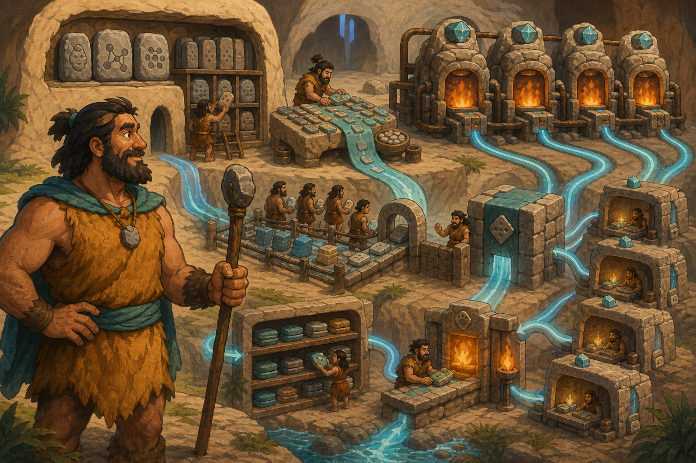

# 05 — LLM Infrastructure

> “A large language model is not one giant brain. It is a carefully supplied workshop whose memory, roads, queues, and rules must agree.” — Chief Grog

## 🎯 Learning Objectives

- Describe the major components of an LLM inference platform.
- Explain model weights, tokenisation, context, attention caches, and numerical precision.
- Relate model size and request shape to GPU memory and scale.
- Acquire model artifacts with version and trust controls.
- Recognise production concerns involving distributed inference, safety, data, availability, and cost.

## 🏕️ Caveman Story

Chief Grog builds the city's largest thinking workshop. Its knowledge tablets fill an enormous vault. A translator converts every sentence into small symbols. Several GPU furnaces share the work, while cache shelves remember earlier parts of each conversation.

More visitors arrive. Their long scrolls consume table space, queues grow, and a failed furnace interrupts answers. Grog adds replicas, traffic rules, guarded artifacts, and a tested rollback path.

The city now operates **LLM infrastructure**, not merely an LLM.

## 🖼️ Big Concept Illustration



```text
Approved model registry / object storage
                  ↓
        Model weights + tokenizer
                  ↓
Gateway → Queue → Serving engine → GPU worker(s)
                              ↕       ↕
                         KV cache   GPU memory
                              ↕       ↕
                         Scheduler / interconnect
                  ↓
       Response + safety + telemetry
```

| Caveman workshop | LLM infrastructure |
| --- | --- |
| Knowledge tablets | Model weights |
| Translator desk | Tokenizer and chat template |
| Visitor scroll | Prompt and context |
| Memory shelves | Key-value cache |
| GPU furnaces | Accelerators |
| Bridges between furnaces | GPU interconnect |
| Approved vault seal | Artifact provenance and revision |
| Extra workshops | Replicas or distributed workers |

## 📖 Concept Explained Simply

An LLM system combines large artifacts with specialised runtime behaviour:

- **Weights** are learned parameters loaded from storage into memory.
- A **tokenizer** converts text into token IDs understood by the model; its files must match the model.
- The **context window** contains input and generated tokens. Longer contexts increase memory and compute cost.
- The **key-value cache** stores attention information for active sequences, improving generation speed while consuming GPU memory.
- **Precision and quantisation** change memory use, performance, and sometimes output quality or hardware compatibility.
- **Tensor or pipeline parallelism** can split a model across GPUs when one device cannot hold or efficiently serve it.
- **Replicas** increase capacity and availability; splitting one model and cloning a model solve different problems.
- **Serving software** schedules batches, manages caches, streams tokens, and exposes APIs.

### Why Should I Care?

LLMs magnify ordinary infrastructure constraints. Model files may be tens or hundreds of gigabytes, startup can be slow, active contexts consume changing amounts of memory, and every additional generated token costs compute time. Small configuration decisions can strongly affect capacity and cost.

## 🌍 Real Linux Example

A release pipeline approves a precise model revision, scans artifacts, and mirrors them into controlled storage. GPU nodes prefetch the model before rollout. The serving engine loads matching weights, tokenizer, and chat template, then exposes private endpoints behind a gateway.

A canary receives limited traffic. Engineers compare latency, errors, token throughput, quality, safety, and cost with the previous version. The deployment expands only if both system and model gates pass.

Production teams also plan for GPU loss, zone failure, cache warm-up, capacity shortages, data residency, prompt privacy, model licences, and emergency rollback.

## 🛠️ Commands Introduced

The current Hugging Face Hub CLI is `hf`. Use only approved repositories, inspect licences/model cards, and avoid passing tokens directly on the command line.

### Inspect the Client Environment

```bash
hf env
hf auth whoami
```

- `hf env` prints client and environment information useful for reproducibility.
- `hf auth whoami` confirms which stored identity will access gated or private artifacts.
- Authenticate interactively only when required; keep credentials out of shell history and source control.

### Estimate Before Downloading

```bash
hf download MODEL_REPOSITORY \
  --include '*.json' '*.safetensors' \
  --dry-run
```

`--dry-run` reports what would be downloaded without transferring the model. Review file types and total size before consuming disk space or network bandwidth.

### Download a Pinned Revision

```bash
hf download MODEL_REPOSITORY \
  --revision FULL_COMMIT_HASH \
  --include '*.json' '*.safetensors' \
  --local-dir ./approved-model
```

- Replace placeholders with an approved repository and full immutable commit hash.
- `--revision` prevents a moving branch from silently changing artifacts.
- `--include` limits the files selected.
- `--local-dir` makes the reviewed destination explicit.

Do not run this blindly: model downloads may be large, licences and access conditions apply, and some repositories contain custom code that requires additional trust review. Downloading artifacts does not execute them, but later loaders may.

## 💡 Caveman Tip

Plan memory for more than weights. Runtime overhead, activations, temporary buffers, and a growing key-value cache all compete for GPU memory.

## ⚠️ Common Mistakes

- Estimating GPU memory from parameter count alone.
- Mixing model, tokenizer, configuration, or chat-template revisions.
- Downloading a moving branch into production without provenance checks.
- Enabling remote custom model code without security review.
- Assuming quantisation has no quality or compatibility trade-off.
- Confusing model parallelism with replica scaling.
- Ignoring cold-start time and artifact-distribution bandwidth.
- Treating prompts, caches, logs, and retrieved documents as harmless data.

## 🧪 Hands-on Lab

### Mission: Prepare an Approved Model Release

Use a small public model chosen for the lab:

1. Read its model card, licence, architecture, and intended use.
2. Record the exact repository and full revision hash.
3. Inspect the local `hf` environment and current identity.
4. Dry-run a download limited to configuration and safe tensor files.
5. Review the estimated size and required free space.
6. Download the pinned revision into an explicit lab directory if approved.
7. Verify that model, tokenizer, and configuration belong to the same revision.
8. Design canary, quality, safety, and rollback gates for serving it.

Do not publish or deploy the artifact beyond the lab without licence, security, and organisational approval.

## 📝 Quick Recap

```text
Pinned artifacts + Matching tokenizer + Serving engine
        + GPU memory + Cache + Network + Controls
                          =
                Operable LLM platform
```

## 🧠 Interview Questions

1. What consumes GPU memory during LLM inference?
2. What is the key-value cache, and why does context length matter?
3. How do model parallelism and replicas differ?
4. Why should model artifacts be pinned to an immutable revision?
5. What are the trade-offs of quantisation?
6. What would you validate during a model canary release?

## 📚 What's Next

An LLM platform must reveal whether it is fast, healthy, useful, and affordable. [06 — AI Observability](06-ai-observability.md) builds that complete view.
