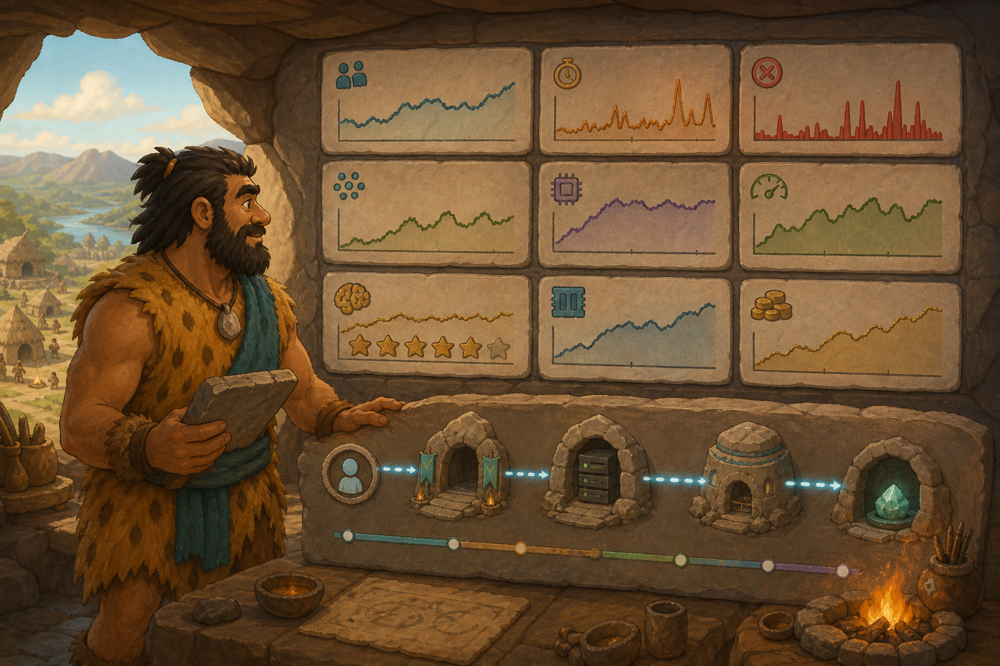

# 06 — AI Observability

> “Count the visitors, watch the queue, inspect the furnaces—and still ask whether the answers helped.” — Chief Grog

## 🎯 Learning Objectives

- Separate infrastructure, serving, retrieval, model-quality, and business signals.
- Explain metrics, logs, traces, profiles, dashboards, alerts, and service objectives.
- Choose useful AI measurements for latency, tokens, queues, GPU resources, quality, safety, and cost.
- Inspect Prometheus-compatible serving metrics and NVIDIA GPU telemetry.
- Follow an evidence-based AI incident workflow.

## 🏕️ Caveman Story

Chief Grog's thinking workshops appear busy, yet villagers complain about slow and unhelpful answers.

The forge gauge says the GPUs are active. That does not reveal a long request queue. The queue count does not reveal poor retrieval. Fast responses do not reveal incorrect answers.

Grog builds one watchtower that connects every signal—from visitor to gateway, retrieval archive, model workshop, GPU, answer quality, and cost.

## 🖼️ Big Concept Illustration



```text
One request trace
Client → Gateway → Retrieval → Model server → GPU → Response
   │         │          │            │          │        │
   └─────────┴──────────┴────────────┴──────────┴────────┘
          metrics + logs + traces + evaluations
```

| View | Important examples |
| --- | --- |
| User | availability, end-to-end latency, failed requests |
| Serving | queue depth, concurrency, time to first token, tokens/second |
| Retrieval | recall, relevance, empty results, filter behaviour |
| Model | answer quality, safety, drift, output length |
| GPU | utilisation, memory, temperature, power, errors |
| Business | task success, usage, cost per request or useful outcome |

## 📖 Concept Explained Simply

**Observability** is the ability to understand a system's internal state from evidence it produces.

- **Metrics** are numerical time series used for rates, trends, dashboards, and alerts.
- **Logs** record discrete events with context.
- **Traces** follow a request across services and expose where time was spent.
- **Profiles** show where CPU, GPU, or memory work occurs inside a process.
- **Evaluations** measure model and retrieval behaviour that infrastructure metrics cannot describe.

For online AI services, begin with request rate, errors, and latency, then add saturation signals. LLM-specific signals include time to first token, inter-token latency, input/output tokens, queue depth, cache usage, batch size, and finish reason. Hardware signals include GPU memory, utilisation, temperature, power, and fault events.

Use percentiles for latency because averages hide the slow tail. Control metric label cardinality: never place raw prompts, user IDs, request IDs, or unbounded model inputs in metric labels.

### Why Should I Care?

A dashboard can show green infrastructure while users receive wrong answers. AI observability must connect reliability and resources to retrieval quality, model quality, safety, and cost.

## 🌍 Real Linux Example

A latency alert fires for a RAG assistant. The trace shows most time is spent in retrieval, not generation. Vector database metrics reveal a growing search delay after an index change. GPU utilisation is low because requests are waiting upstream.

The team rolls back the index configuration and verifies user-visible latency recovery. Correlated evidence prevents an unnecessary and expensive GPU scale-out.

Production alerts should describe user impact and link to a runbook. Dashboards support investigation; alerts should demand a meaningful human action.

## 🛠️ Commands Introduced

These commands are read-only except configuration validation reads the named local file. Run them against approved lab or monitoring endpoints.

### Inspect Model-Server Metrics

```bash
curl --fail --silent --show-error http://127.0.0.1:8000/metrics | head -n 40
```

vLLM exposes Prometheus-compatible metrics at `/metrics`. `curl` is intentionally reused from serving because observability begins at that same service boundary; `head` keeps the first inspection readable.

To locate relevant metric families:

```bash
curl --fail --silent --show-error http://127.0.0.1:8000/metrics \
  | grep -Ei 'request|queue|token|cache|latency|time_to_first'
```

Metric names can change between serving-engine versions. Discover what the installed version exposes before writing dashboards or alerts.

### Validate Prometheus Configuration

```bash
promtool check config prometheus.yml
promtool check rules alerts.yml
```

- `check config` validates Prometheus configuration syntax and referenced rule files.
- `check rules` validates rule syntax.
- Validation does not prove that targets are reachable or that alert thresholds are useful.

### Inspect Data-Centre GPU Telemetry

```bash
dcgmi discovery --list
dcgmi dmon --count 5
```

- `discovery --list` shows GPUs visible to NVIDIA Data Center GPU Manager.
- `dmon --count 5` samples supported device fields five times and stops.
- DCGM is intended for supported NVIDIA data-centre environments and may not be installed on ordinary hosts.

The GPU lesson taught interactive `nvidia-smi`; DCGM appears here because production fleets need structured health and telemetry collection.

## 💡 Caveman Tip

Start every incident with a user-visible symptom and a time window. Then correlate the same request across traces, serving metrics, retrieval evidence, GPU signals, logs, and recent changes.

## ⚠️ Common Mistakes

- Monitoring only GPU utilisation and memory.
- Using average latency instead of useful percentiles.
- Mixing prompt contents or user identifiers into metric labels.
- Logging sensitive inputs and outputs without redaction or retention policy.
- Alerting on every fluctuation instead of actionable user impact.
- Measuring answer quality only once before deployment.
- Changing model, prompt, retrieval, and infrastructure simultaneously.
- Scaling capacity before locating the constrained layer.

## 🧪 Hands-on Lab

### Mission: Investigate a Slow Answer

1. Send a bounded request to a prepared lab model service.
2. Record end-to-end latency and time to first token.
3. Inspect the service's Prometheus metrics for queue and token signals.
4. Validate the provided Prometheus configuration and alert rules.
5. Inspect a short sample of GPU telemetry if DCGM is available.
6. Draw a trace across gateway, retrieval, model server, and GPU.
7. Propose one hypothesis and the evidence that would disprove it.
8. Add a simple offline quality check for the returned answer.
9. Write an alert description containing impact, threshold, and first runbook step.

## 📝 Quick Recap

```text
Healthy AI service
 = reliable infrastructure
 + responsive serving
 + relevant retrieval
 + useful and safe answers
 + controlled cost
```

## 🧠 Interview Questions

1. How does AI observability differ from ordinary infrastructure monitoring?
2. Why should latency be viewed as percentiles?
3. Which metrics reveal serving saturation?
4. Why can high GPU utilisation be healthy while low utilisation signals an upstream bottleneck?
5. How would you monitor RAG quality?
6. Which data should never become a Prometheus label?
7. How would you investigate rising time to first token?

## 📚 What's Next

You have followed Chief Grog from a single computer to an observable AI platform. Return to the [module map](README.md), complete the end-to-end mission, and practise explaining every layer in your own words.
