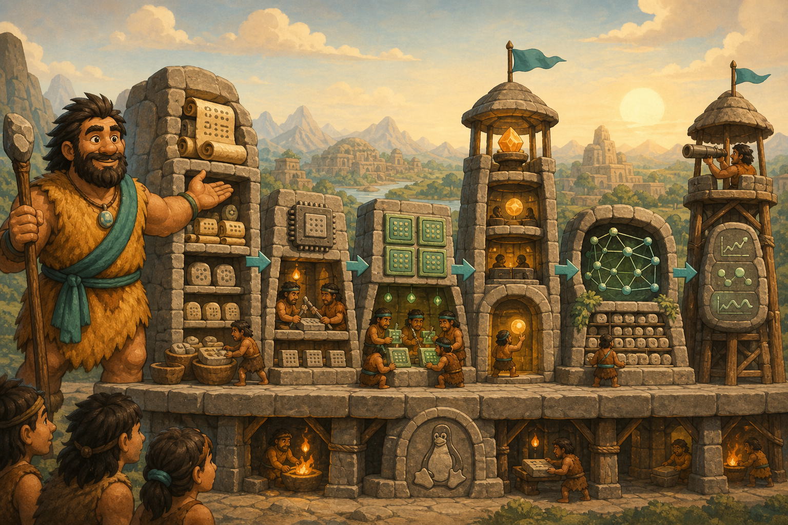

# 10 — Teaching the City to Think: Understanding AI Infrastructure

> “A clever idea becomes useful only when the whole city can deliver it safely, quickly, and repeatedly.” — Chief Grog

## 🎯 Learning Objectives

By the end of this module, you will be able to:

- Explain the infrastructure behind an AI response.
- Compare CPU, system RAM, GPU, and GPU memory without confusing their roles.
- Follow a request through an AI model-serving system.
- Describe how vector databases support semantic retrieval and RAG.
- Identify the major layers of production LLM infrastructure.
- Monitor both system health and model behaviour.

## 🏕️ Caveman Story

Chief Grog's city now has strong walls, organised workers, containers, and cloud roads. But the citizens want something new: a workshop that can understand questions and produce useful answers.

Grog soon discovers that the thinking stone cannot work alone. It needs powerful workers, enormous memory tables, safe storage, fast roads, request queues, searchable knowledge, and watchtowers that detect trouble.

The city is not merely installing AI. It is building **AI infrastructure**.

## 🖼️ Big Concept Illustration



```text
User request
     ↓
API gateway → Model server → CPU / GPU
                    ↕              ↕
              Vector database   RAM / VRAM
                    ↕              ↕
               Knowledge       Model storage
                    \              /
                     Observability
```

```text
Linux → Containers → Kubernetes → AI platform
  Foundation remains visible at every layer
```

## 📖 Concept Explained Simply

AI infrastructure is everything required to turn a trained model into a dependable service.

| Lesson | Caveman idea | Engineering outcome |
| --- | --- | --- |
| [01 — AI Infrastructure](01-ai-infrastructure.md) | The complete thinking city | Understand the end-to-end stack |
| [02 — CPU vs GPU](02-cpu-vs-gpu.md) | Expert worker vs parallel worker team | Choose and inspect compute resources |
| [03 — AI Model Serving](03-ai-model-serving.md) | Public answer workshop | Serve models through reliable APIs |
| [04 — Vector Databases](04-vector-databases.md) | Meaning-based treasure archive | Retrieve semantically related knowledge |
| [05 — LLM Infrastructure](05-llm-infrastructure.md) | Large language workshop | Operate model artifacts, memory, batching, and scale |
| [06 — AI Observability](06-ai-observability.md) | City watchtower | Measure performance, reliability, quality, and cost |

### Why Should I Care?

An impressive model can still become a poor product when it is slow, unavailable, insecure, too expensive, or disconnected from trusted data. AI infrastructure is where Linux, networking, storage, containers, cloud, security, and operations meet real AI workloads.

## 🌍 Real Linux Example

A user asks a support assistant a question. A gateway authenticates the request. An embedding service converts the question into a vector, a vector database retrieves relevant documents, and an LLM server generates an answer on a GPU. Metrics and traces record latency, token usage, failures, and resource pressure.

Cloud services may manage parts of this stack, but engineers still decide capacity, access, data flow, deployment strategy, observability, and recovery.

## 🛠️ Commands Introduced

| Lesson | Commands and interfaces taught here |
| --- | --- |
| AI Infrastructure | `lspci`, `numactl --hardware`, `nvidia-smi topo -m` |
| CPU vs GPU | `lscpu`, `nvidia-smi -L`, GPU query and live-monitor modes |
| AI Model Serving | `vllm serve`, service health/model endpoints, `curl` inference requests |
| Vector Databases | Qdrant REST calls for collections, points, and queries |
| LLM Infrastructure | `hf env`, `hf auth whoami`, `hf download --dry-run`, revision-pinned downloads |
| AI Observability | Prometheus metric inspection, `promtool check config`, DCGM monitoring |

Commands reappear only when a lesson needs them in a connected production workflow. The reason for any repetition is stated beside the command.

## 💡 Caveman Tip

When an AI answer is slow, do not immediately blame the GPU. Follow the complete path: queue, retrieval, model server, GPU, memory, network, storage, and downstream services.

## ⚠️ Common Mistakes

- Treating the model as the entire AI system.
- Confusing system RAM with GPU memory.
- Assuming GPU utilisation alone proves good performance.
- Measuring only average latency and hiding slow requests.
- Placing private data into prompts or vector stores without controls.
- Deploying a new model without quality, safety, capacity, and rollback checks.
- Scaling replicas before locating the real bottleneck.

## 🧪 Hands-on Lab

### Module Mission: Trace One AI Request

Using disposable local or prepared lab resources:

1. Draw the path from client request to final response.
2. Inventory CPU, memory, GPU, disk, and network dependencies.
3. inspect a model server's health and model endpoints.
4. Send one small inference request and record its latency.
5. Insert and retrieve a few sample vectors from a disposable collection.
6. Identify request, model, GPU, retrieval, and cost signals.
7. Describe how you would roll back a harmful or overloaded model version.

Use small public models and synthetic data. Never place secrets or production data in the lab.

## 📝 Quick Recap

```text
Model + Compute + Memory + Storage + Network
      + Serving + Retrieval + Observability
                      =
          Production AI Infrastructure
```

## 🧠 Interview Questions

1. What belongs to AI infrastructure besides the model?
2. Why are both latency and throughput important in inference?
3. How are CPU, RAM, GPU, and GPU memory used differently?
4. Where does a vector database fit into a RAG request?
5. What makes an LLM deployment production-ready?
6. How would you distinguish system health from model quality?

## 📚 What's Next

Begin with [01 — AI Infrastructure](01-ai-infrastructure.md) and follow one request through Chief Grog's complete thinking city.

## 🧭 Chapter Navigation

[← Building Modern Cities](../09-building-modern-cities%20-%20Cloud-Containers-Kubernetes/README.md) · [Course Home](../README.md) · [Labs](../labs/README.md) · [Cheatsheets](../cheatsheets/README.md)
